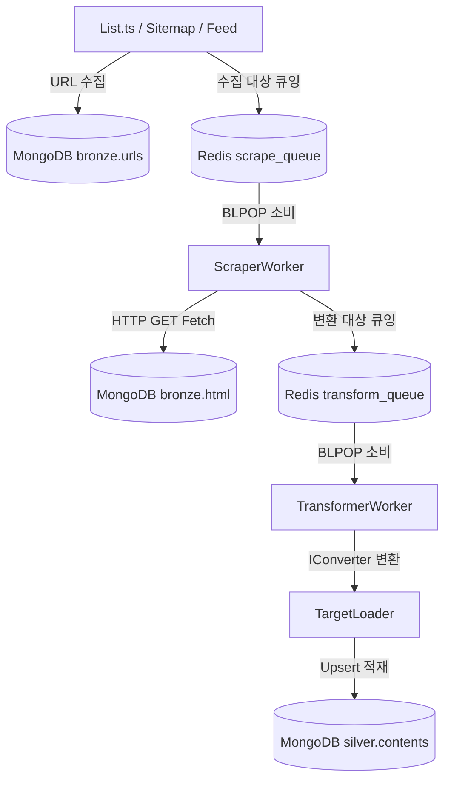

# 🛠️ Site Development & Crawler Architecture Rules (DevelopSitesRules.md)

이 문서는 `src/crawler` 디렉토리 하위 시스템의 전체 아키텍처, 작동 방식, 공통 유틸리티 사용 규칙 및 신규 사이트 추가 시 준수해야 하는 개발 표준을 상세히 정의합니다.

---

## 1. 🏗️ 전체 파이프라인 아키텍처

Clipper는 **3단계 Bronze → Silver 파이프라인** 구조를 따르며, Redis 큐와 MongoDB를 이용해 비동기적으로 작업을 수행합니다.



### 1.1 데이터 레이어 구분
1. **Bronze Layer (`bronze` DB)**
   - 수집된 원본 데이터(Raw HTML, Raw JSON)를 저장합니다.
   - 예시: `bronze/geeknews.html` (본문 HTML 문서), `bronze/geeknews.urls` (수집 진행 상태 및 메타).
2. **Silver Layer (`silver` DB)**
   - HTML/JSON을 Markdown 및 정제된 스키마로 변환하여 저장합니다.
   - 예시: `silver/geeknews.contents`.

---

## 2. 🗃️ 핵심 공통 클래스 및 인터페이스 (`src/crawler/core/`)

모든 신규 사이트는 아래 핵심 공통 클래스들의 규격을 확장하거나 인터페이스를 구현해야 합니다.

### 2.1 `BaseListService`
목록 페이지나 피드에서 신규 글 URL 목록을 파싱하여 수집 큐에 넣는 기본 서비스입니다.
- **주요 메서드**:
  - `init()`: 데이터베이스 연결 및 Redis 초기화.
  - `seedCache()`: 중복 큐잉 방지를 위해 이미 완료된 ID 목록을 Redis 캐시 세트에 저장.
  - `processItem(id, url, title)`: Redis 캐시 및 DB 중복 체크 후 신규일 경우에만 `urls` 컬렉션 추가 및 `scrape_queue`에 푸시.
  - `close()`: `redis.quit()` 및 `MongoDatabase.close()`를 실행하여 커넥션 해제.
- **라이프사이클 제약**: hang 현상을 방지하기 위해 `finally` 블록에서 반드시 `await this.close()`를 호출해야 합니다.

### 2.2 `IConverter<T>`
HTML 본문에서 텍스트 및 메타데이터를 정제된 구조로 변환하는 규격입니다.
```typescript
export interface IConverter<T> {
  convertHtmlToMarkdown(html: string, url: string): Promise<T>;
}
```
- 본문 파싱 시 **JSON-LD (`application/ld+json`)** 또는 **메타 태그** 파싱을 우선 고려하고, DOM 구조 파싱으로 폴백(Fallback)하도록 작성합니다.

### 2.3 `BaseRefreshUrls`
실패한 URL이나 미수집된 타겟의 큐를 복구 및 재처리하는 복구기입니다.
- `scanHtmlForUrls()`: 이미 수집된 HTML 내에서 도메인 내부 링크(`a[href]`)를 재탐색하여 신규 타겟을 자동으로 발굴합니다.
- **예외 필터**: 템플릿용 자리표시자 URL(공백, `<>`, `{`, `}`, `%7B`, `%7D` 포함) 및 바이너리 링크(`.png`, `.zip`, `.pdf` 등)를 스킵하는 검증 필터가 내장되어 있습니다.

---

## 3. ⚙️ 백그라운드 워커 시스템 (`src/crawler/workers/`)

### 3.1 `ScraperWorker`
- **역할**: `scrape_queue:{site}:{priority}` 큐를 감시하며 실제 HTTP 요청을 보내 HTML을 수집합니다.
- **큐 우선순위**: `high` → `medium` → `low` 순서로 큐들을 배치하되, 각 등급 내부에서 사이트 큐 순서를 무작위로 섞은(Shuffle) 단일 큐 목록 배열을 생성하여 단 한 번의 `blpop` 멀티 인자 호출로 대기 및 소비합니다. 이를 통해 특정 사이트의 기아 현상(Starvation)을 방지합니다.
- **에러 핸들링**: 3회 이상 실패 시 에러 로그를 남기고 문서를 `dead_letter_queue`로 이동시킵니다.
- **인스턴스 확장**: `make restart SCALE=3` 등을 이용해 병렬 컨테이너 실행이 가능하도록 설계되었습니다.

### 3.2 `TransformerWorker`
- **역할**: `transform_queue`를 소비하며 HTML을 Markdown으로 파싱 및 변환합니다.
- **후처리**: `linkedin`을 제외한 모든 사이트에 대해 자동으로 `downloadImages()` 유틸을 호출하여 이미지를 로컬(`data/sites/{site}/images/{id}/`)로 다운로드하고 마크다운 경로 치환 및 Collected Images 매핑을 추가합니다. (파비콘 제거 여부는 `refreshSilver.imageDownload.removeFavicons` 옵션을 반영합니다.)

---

## 4. 🛠️ 공통 유틸리티 기능 (`src/crawler/utils/`)

개발 편의성 및 데이터 정밀도를 위해 제공되는 공통 유틸리티들을 반드시 우선 활용하십시오.

### 4.1 `UrlUtils`
- `UrlUtils.extractJobId(url)`: 링크드인 URL 패턴에서 안정적으로 공고 ID를 추출합니다.
- `UrlUtils.standardizeLocation(loc)`: `country.json` 설정을 참조해 지오(Geo) 정보를 표준 국가명(예: "South Korea")으로 매핑합니다.
- `UrlUtils.stripTrackingParams(url)`: `utm_source`, `ref`, `fbclid` 등 모든 광고/트래킹 쿼리 매개변수를 깔끔하게 제거합니다.
- `UrlUtils.isBinaryUrl(url)`: `.zip`, `.pdf`, `.webp`, `.ico` 등의 바이너리 파일 확장자를 감지합니다.

### 4.2 `imageDownloader` (`downloadImages`)
- 이미지의 로컬 다운로드 및 마크다운 치환 작업을 수행합니다.
- **주요 옵션**:
  - `removeFavicons`: `true`로 지정 시 마크다운 파싱 결과에서 불필요한 파비콘 이미지 링크들을 자동 소거합니다.
  - `htmlSource`: HTML 데이터를 추출할 원본 필드를 지정합니다.

### 4.3 `HtmlMinifier`
- DB 저장 공간 및 전송 리소스를 줄이기 위해 raw HTML에서 공백, 개행 및 불필요한 주석 등을 최소화(Minify)합니다. (Preserve JSON-LD 옵션 지원)

---

## 5. 📝 신규 사이트 추가 절차 및 규칙

신규 크롤러 사이트 `{site}`를 제작할 때는 다음 단계를 차례대로 수행하고 가이드라인을 준수하십시오.

### 5.1 파일 생성
1. **설정 등록 (`src/crawler/sites/{site}/site.config.ts`)**
   - 고유 `key`, `name`, `domain`, `favicon`, `indexes`, `scraper`, `transformer`, `targetLoader` 정의.
   - `excludePatterns` 필수 항목: `['favicon', 'login', 'logout', 'signup']`를 포함시켜 크롤러가 불필요한 세션/아이콘 페이지를 탐색하는 것을 차단.
2. **변환기 작성 (`src/crawler/sites/{site}/Converter.ts`)**
   - `IConverter` 구현 클래스 작성. TurndownService 옵션 튜닝.
3. **목록 스크래퍼 작성 (`src/crawler/sites/{site}/List.ts`)**
   - 사이트 구조에 맞춰 페이지네이션, 사이트맵 파서, RSS 피드 수집기 중 적절한 방식을 설계하여 `BaseListService`를 구현.

### 5.2 데이터베이스 인덱스 필수 규격
사이트 Descriptor의 `indexes` 필드에 다음 인덱스를 기본으로 정의합니다:
- **Bronze HTML**: `{ id: 1 }` (unique)
- **Bronze URLs**: `{ id: 1 }` (unique), `{ status: 1, id: 1 }`
- **Silver Contents**: `{ id: 1 }` (unique), `{ publishedAt: -1 }`, 그리고 전문 검색용 **Text 인덱스** (`{ title: 'text', markdown: 'text', ... }` + `weights`/`name: 'text_idx'`)

### 5.3 커넥션 라이프사이클 준수
- DB 커넥션 릭(Leak)을 방지하기 위해 모든 비동기 프로세스의 실행 블록 끝 또는 `finally` 절에서 반드시 DB 연결을 안전하게 닫아야 합니다:
```typescript
try {
  await service.run();
} finally {
  await service.close();
}
```

### 5.4 코드 품질 및 타입 가이드
- TypeScript의 `any` 사용을 금지하며 명시적 반환 타입과 파라미터 규격을 선언합니다.
- 예외 상황이 발생하면 빈 `catch` 블록으로 방치하지 않고 `console.warn` 또는 `Logger.warn`을 통해 추적 가능한 맥락 로그를 출력합니다.
