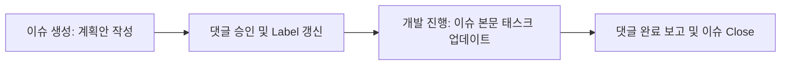

# 문서화 수명 주기 & 아티팩트 관리 가이드 (documentation_lifecycle.md)

이 가이드는 Gitea 이슈(Issues) 관리 시스템을 활용한 프로젝트 설계 변경, 개발 진행 절차, 그리고 아티팩트 수명 주기를 규정합니다.

---

## 1. 문서화 및 작업 관리 수명 주기 순서

모든 기능 추가 및 사양 변경 프로세스는 로컬 마크다운 파일 대신 **Gitea 이슈(Issue)**를 매개체로 진행됩니다.

1. **계획 제안 (Plan)**:
   - 에이전트는 새로운 개발 작업을 시작할 때 Gitea API 혹은 `tea` CLI를 사용해 새로운 이슈를 생성합니다.
   - 이슈 제목 규칙: `[SCR-###] 기능/버그 요약`
   - 이슈 본문(Description)에 계획서(Plan) 내용 및 구현에 필요한 세부 작업 목록(Task Checkbox `- [ ]`)을 작성합니다.
   - 생성된 이슈의 웹 주소를 채팅창에 고지하여 사용자의 승인을 기다립니다.

2. **계획 승인 및 작업 개시 (Task / Execution)**:
   - 사용자는 Gitea 이슈에 댓글(예: "승인")을 달거나 라벨을 `status/in-progress`로 변경하여 승인합니다.
   - 에이전트는 작업을 자율 진행하며, 완료되는 태스크에 맞춰 Gitea 이슈 본문의 마크다운 체크박스를 실시간으로 체크(`- [x]`) 업데이트합니다.

3. **결과 보고 및 마감 (Walkthrough / Close)**:
   - 구현 및 테스트가 완료되면, 에이전트는 Gitea 이슈에 검토보고서 및 결과보고서(Walkthrough)를 **댓글(Comment)**로 작성하여 보고합니다.
   - 최종적으로 에이전트가 이슈를 `Closed` 처리하고 라벨을 `status/done`으로 변경하여 작업을 종료합니다.

---

## 2. 로컬 아티팩트 최소화 및 아카이브 폐지

* **로컬 파일 차단 (100% Gitea 이관)**: 중요 의사 결정서(ADR)를 포함한 상세 계획, 태스크, 결과보고서는 모두 Gitea 이슈 히스토리에 영구 보존되므로 로컬 `docs/artifacts/` 폴더에 마크다운 파일을 개별 생성하여 보존하지 않습니다.
* **ADR 관리 규칙**: 의사 결정서(ADR)는 Gitea 이슈 생성 시 `type/adr` 라벨을 달아 Gitea 저장소 상에서 직접 검색 및 누적 관리합니다.
* **Squash & Archive 정책 폐지**: 로컬 파일 생성이 완전히 배제되므로 기존 `make agents-squash` 및 `###-###.archive.md` 압축/보관 절차는 더 이상 수행하지 않습니다.

