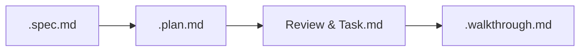

# 문서화 수명 주기 & 아티팩트 관리 가이드 (documentation_lifecycle.md)

이 가이드는 프로젝트의 설계 변경, 아키텍처 개선, 개발 진행 시 준수해야 하는 **문서화 수명 주기(Documentation Lifecycle)** 및 아티팩트 보존 방침을 규정합니다.

---

## 1. 문서화 수명 주기 순서

모든 기능 추가 및 사양 변경 프로세스는 다음 순서로 문서를 작성하며 진행됩니다.

* **요구명세서 (`.spec.md`)**: 제품 기획 및 기능 정의 단계 (필요 시 작성)
* **계획서 (`.plan.md`)**: 구체적인 파일 설계 및 구현 범위 정의 (작성 후 반드시 사용자 사전 승인 획득 필수)
* **리뷰 문서 및 할 일 목록 (`.review.md`, `.task.md`)**: 변경 전/후 대비 검토 및 할 일 정의
* **결과보고서 (`.walkthrough.md`)**: 기능 구현 완료 보고 및 자가 검증 결과 요약

---

## 2. 디렉토리 표준 및 명명 규칙

* 모든 산출물 문서는 `docs/artifacts/` 단일 디렉토리 내에 보존되어야 합니다.
* 각 작업 단위별 변경 이력을 구분하기 위해 파일명 앞에 **3자리 순차 번호 접두사**를 매깁니다.
  - 요구명세서: `###-filename.spec.md` (예: `001-integrate-ebook.spec.md`)
  - 의사결정서: `###-filename.adr.md` (예: `023-redis-namespace.adr.md`)
  - 계획서: `###-filename.plan.md`
  - 리뷰 문서: `###-filename.review.md`
  - 할 일 목록: `###-filename.task.md`
  - 결과보고서: `###-filename.walkthrough.md`
  - 장애 분석서: `###-filename.issue.md`
  - 테스트 시나리오: `###-filename.test.md`
* **`CHANGELOG.md`**: 프로젝트 루트 디렉토리의 단일 변경 이력 파일에 버전/마일스톤 릴리즈 내역을 통합 기록합니다.

---

## 3. 변경 규모별 문서화 의무 차등

| 등급 | 대상 | 필수 문서 |
|:---|:---|:---|
| **Major** | 기능 추가, 아키텍처 변경, Bugfix | `.review.md` + `.task.md` + `.walkthrough.md` |
| **Minor** | 리팩터링, 패키지/의존성 설정 변경 | `.task.md` 1종 (축약형) |
| **Trivial** | 오타 수정, 주석 보완, 문서 단독 수정 | CHANGELOG.md 내 1줄 기술 (번호 미부여) |

* **Bugfix (버그 수정)**는 등급과 관계없이 `.review.md` 및 `.task.md` 최상단에 **Bugfix** 태그를 반드시 명시해야 합니다.
* Major 작업 시 산출물 누락 시 완료 보고가 반려됩니다.

---

## 4. 아티팩트 Squash 및 Archive 정책

* **Squash**: `make agents-squash` 유틸리티를 실행하면 `.review.md`, `.task.md`, `.walkthrough.md` 3종 문서가 단일 `.summary.md` 1개 파일로 자동 압축되어 토큰 점유율을 크게 낮춥니다.
* **Archive**: 압축 처리가 완료된 뒤, 10개 단위의 파일들을 묶어 `###-###.archive.md` 통합 파일로 아카이빙하고 원본 개별 문서는 제거합니다.
* **보존 대상**: `.spec.md`, `.adr.md`, `.plan.md`, `.issue.md`, `.test.md` 문서는 아카이빙에서 제외되며 원본을 상시 보존합니다.
* **정리 제안**: 작업 종료 시 누적 아티팩트 파일 수가 50개를 초과할 시 에이전트는 사용자에게 `make agents-squash` 실행을 먼저 제안하여 컨텍스트 효율을 보존합니다.

---

## 5. 🛠️ 도구 사용 및 경로 구분 규칙 (Gemini Brain vs Workspace)

에이전트는 아티팩트와 소스 코드를 생성/수정할 때 경로에 따라 도구 사용 방식을 명확히 구분해야 합니다.

### A. 플랫폼 아티팩트 (Gemini Brain 영역)
* **대상**: 사용자와 소통하고 승인을 받기 위한 계획서(`.plan.md`), 작업 목록(`.task.md`), 결과보고서(`.walkthrough.md`) 등.
* **경로**: `/Users/ejpark/.gemini/antigravity-cli/brain/<conversation-id>/` (Gemini Brain 디렉토리)
* **도구 호출**: `write_to_file` 호출 시 `ArtifactMetadata` 필드를 **필수 기재**해야 합니다. (생략 시 일반 텍스트 파일로 처리되어 UI 렌더링 누락)

### B. 로컬 프로젝트 파일 (Workspace 영역)
* **대상**: `src/` 코드, `scripts/` 스크립트, 그리고 프로젝트 저장소 내 보존용 문서(`docs/artifacts/` 하위 파일 등).
* **경로**: `/Users/ejpark/workspace/scraper/...` (작업 공간 디렉토리)
* **도구 호출**: `write_to_file` 호출 시 `ArtifactMetadata` 필드를 **반드시 제거(omit)**해야 합니다. (기재 시 경로가 Brain 영역이 아니라는 유효성 검사 에러 발생)

