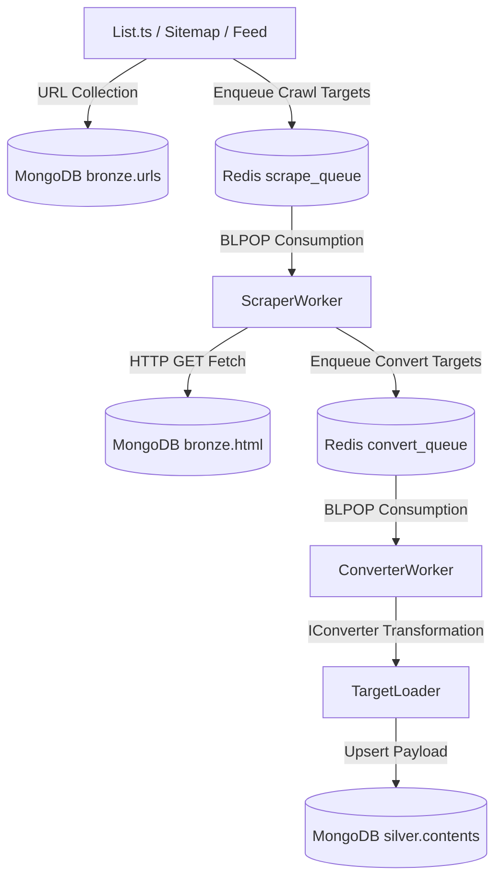

# 🛠️ Site Development & Crawler Architecture Rules (DevelopSitesSkills.md)

This document defines the overall architecture, operation methods, common utility rules, and development standards to comply with when adding new sites to the `src/crawler` subsystem.

---

## 1. 🏗️ Pipeline Architecture

Clipper follows a **3-stage Bronze ➡️ Silver pipeline** architecture, executing tasks asynchronously using Redis queues and MongoDB.



### 1.1 Data Layer Division
1. **Bronze Layer (`bronze` DB)**
   - Stores raw collected data (Raw HTML, Raw JSON).
   - Examples: `bronze/geeknews.html` (raw body HTML), `bronze/geeknews.urls` (crawling status and metadata).
2. **Silver Layer (`silver` DB)**
   - Transforms raw HTML/JSON into Markdown and structured schemas.
   - Example: `silver/geeknews.contents`.

---

## 2. 🗃️ Core Shared Classes & Interfaces ([src/crawler/core/](src/crawler/core/))

All new sites must extend the following core classes or implement these interfaces.

### 2.1 [BaseListService.ts](src/crawler/core/BaseListService.ts)
A base service that parses list pages or feeds to find new article URLs and pushes them to the crawl queue.
- **Key Methods**:
  - `init()`: Establishes database and Redis connections.
  - `seedCache()`: Caches already processed IDs in a Redis set to avoid double-queuing.
  - `processItem(id, url, title)`: Checks Redis cache and MongoDB duplicates; if new, registers the URL to the collection and pushes it to `scrape_queue`.
  - `close()`: Invokes `redis.quit()` and `MongoDatabase.close()` to release connections.
- **Lifecycle Constraint**: To prevent hangs, you must call `await this.close()` inside a `finally` block.

### 2.2 [IConverter.ts](src/crawler/core/IConverter.ts)
An interface for cleaning up HTML bodies and converting them into structured markdown formats.
```typescript
export interface IConverter<T> {
  convertHtmlToMarkdown(html: string, url: string): Promise<T>;
}
```
- When parsing the main body, prioritize parsing **JSON-LD (`application/ld+json`)** or **Meta Tags** before falling back to DOM structure selectors.

### 2.3 [BaseRefreshConvert.ts](src/crawler/core/BaseRefreshConvert.ts)
A recovery script that rescans and enqueues failed or uncollected targets.
- `scanHtmlForUrls()`: Rescans internal links (`a[href]`) inside already crawled HTML to automatically discover new targets.
- **Exception Filter**: Includes built-in filters to skip placeholder URLs (containing spaces, `<>`, `{`, `}`, `%7B`, `%7D`) and binary file links (`.png`, `.zip`, `.pdf`, etc.).

---

## 3. ⚙️ Background Worker System ([src/crawler/workers/](src/crawler/workers/))

### 3.1 [ScraperWorker.ts](src/crawler/workers/ScraperWorker.ts)
- **Role**: Listens to `scrape_queue:{site}:{priority}` queues and fetches raw HTML via HTTP GET.
- **Queue Priority**: Processes `high` ➡️ `medium` ➡️ `low` queues sequentially, but shuffles the site queues within each priority tier into a single array before calling `blpop`. This multi-argument `blpop` prevents site starvation.
- **Error Handling**: Moves documents to the `dead_letter_queue` after 3 failed attempts.
- **Scaling**: Supports running parallel container instances using commands like `make restart SCALE=3`.

### 3.2 [ConverterWorker.ts](src/crawler/workers/ConverterWorker.ts)
- **Role**: Consumes `convert_queue` tasks and transforms raw HTML to Markdown.
- **Post-Processing**: For all sites except `linkedin`, automatically calls the `downloadImages()` utility to download images locally to `data/sites/{site}/images/{id}/` and swaps image paths in Markdown. (Favicon removal follows the `refreshSilver.imageDownload.removeFavicons` setting.)

---

## 4. 🛠️ Common Utility Features ([src/crawler/utils/](src/crawler/utils/))

Always prioritize utilizing existing common utilities for development efficiency and data accuracy.

### 4.1 [UrlUtils.ts](src/crawler/utils/UrlUtils.ts)
- `UrlUtils.extractJobId(url)`: Robustly extracts job IDs from LinkedIn URL patterns.
- `UrlUtils.standardizeLocation(loc)`: Maps geographical info to standardized country names using `country.json`.
- `UrlUtils.stripTrackingParams(url)`: Trims advertising/tracking query parameters (e.g., `utm_source`, `ref`, `fbclid`).
- `UrlUtils.isBinaryUrl(url)`: Detects binary file extensions such as `.zip`, `.pdf`, `.webp`, and `.ico`.

### 4.2 [imageDownloader.ts](src/crawler/utils/imageDownloader.ts) (`downloadImages`)
- Automates local image downloading and path replacement in Markdown.
- **Options**:
  - `removeFavicons`: If set to `true`, automatically filters out useless favicon links from parsed Markdown.
  - `htmlSource`: Sets the source field from which to extract raw HTML data.

### 4.3 [HtmlMinifier.ts](src/crawler/utils/HtmlMinifier.ts)
- Minifies raw HTML (removing whitespace, newlines, and comments) to save DB storage space. (Supports preserving JSON-LD).

---

## 5. 📝 Steps to Add a New Site

Follow these steps when creating a new crawler site `{site}`:

### 5.1 Creating Files
1. **Configuration (`src/crawler/sites/{site}/site.config.ts`)**
   - Define `key`, `name`, `domain`, `favicon`, `indexes`, `scraper`, `converter`, and `targetLoader`.
   - `excludePatterns` must include `['favicon', 'login', 'logout', 'signup']` to prevent crawling useless session or asset pages.
2. **Converter (`src/crawler/sites/{site}/Converter.ts`)**
   - Write a class implementing [IConverter.ts](src/crawler/core/IConverter.ts) and tune TurndownService options.
3. **List Scraper (`src/crawler/sites/{site}/List.ts`)**
   - Implement [BaseListService.ts](src/crawler/core/BaseListService.ts) using pagination, site map parsers, or RSS feeds depending on target site structure.

### 5.2 Mandatory DB Indexes
Declare the following indexes in the site descriptor's `indexes` field:
- **Bronze HTML**: `{ id: 1 }` (unique)
- **Bronze URLs**: `{ id: 1 }` (unique), `{ status: 1, id: 1 }`
- **Silver Contents**: `{ id: 1 }` (unique), `{ publishedAt: -1 }`, and a **Text Index** for full-text search (`{ title: 'text', markdown: 'text', ... }` + `weights`/`name: 'text_idx'`)

### 5.3 Connection Lifecycle Rules
- To prevent database connection leaks, always close database connections in the `finally` block:
```typescript
try {
  await service.run();
} finally {
  await service.close();
}
```

### 5.4 Code Quality & Typing Guidelines
- Avoid using `any`; explicitly declare return types and parameter schemas.
- Do not leave `catch` blocks empty; output traceable context logs using `console.warn` or `Logger.warn`.
