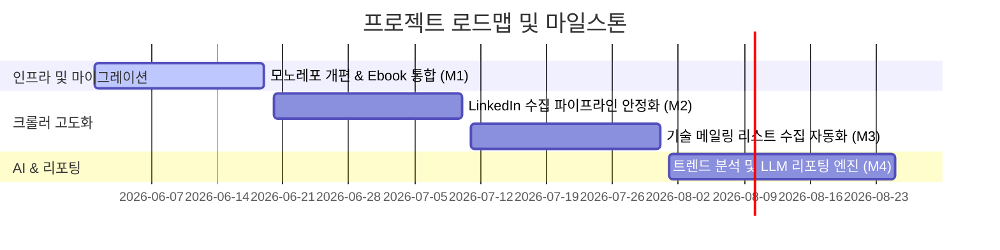

# 🎯 Project Goals & Roadmap (GOAL.md)

이 프로젝트는 **LinkedIn 채용 공고, 메일링 리스트, 기술 서적** 등 흩어져 있는 기술 지식과 정보를 수집 및 구조화하고, 검색 및 LLM 기반 요약/분석을 통해 개발자를 위한 **통합 기술 지식 허브 & 분석 위키(Information Hub & Wiki)**를 구축하는 것을 최종 목표로 합니다.

---

## 👁️ Core Vision (핵심 비전)
1. **분산된 정보의 중앙화**: 웹 크롤러, PDF 파서, Gmail API 등을 통해 유용한 기술 지식을 한데 모읍니다.
2. **AI-Assisted Processing**: 수집된 비정형 데이터(HTML, PDF, 이메일)를 정교한 마크다운 및 JSON 구조로 정제합니다.
3. **고속 시맨틱 검색**: Meilisearch를 연동하여 고유 텍스트 검색 및 의미론적 지식 탐색을 제공합니다.
4. **트렌드 요약 리포팅**: 축적된 기술 트렌드 데이터를 LLM으로 분석하여 인사이트 리포트를 정기 생성합니다.

---

## 🗺️ Milestone Roadmap (마일스톤 로드맵)

### ✅ Milestone 1: 모노레포 아키텍처 개편 및 Ebook 서비스 통합 (완료)
* **목표**: 흩어져 있던 `scraper`와 `ebook` 코드를 단일 모노레포 구조로 통합하고 인프라(Docker Compose Profiles)를 격리합니다.
* **산출물**:
  - `apps/crawler`, `apps/ebook`, `apps/viewer` 프로젝트 이관 및 뼈대 구축.
  - Ebook 마크다운 데이터를 MongoDB/Meilisearch로 일괄 적재하는 `sync-ebooks.ts` 파이프라인 구축.

### ⏳ Milestone 2: LinkedIn Jobs & Company 수집 안정화 (진행 예정)
* **목표**: 채용 정보 및 기업 데이터를 Playwright를 기반으로 동적/안정적으로 수집하여 인맥 및 구인 트렌드 데이터베이스를 구축합니다.
* **산출물**:
  - `apps/crawler/src/sites/linkedin` 하위의 Jobs/Company 스크래퍼 안정화 및 예외 복구(Retry) 로직 최적화.

### ⏳ Milestone 3: 기술 메일링 리스트 수집 자동화 및 통합 (진행 예정)
* **목표**: Gmail API 연동 및 구독 메일링 필터링을 통해 개발 관련 뉴스레터 정보를 정기적으로 아카이빙합니다.
* **산출물**:
  - Maily(josh), GeekNews, PyTorch KR, Daily Dose of DS 등 뉴스레터/포스팅 통합 적재 스크립트 정비.

### ⏳ Milestone 4: 검색 고도화 및 LLM 트렌드 분석 리포팅 (진행 예정)
* **목표**: 저장된 전체 텍스트 지식을 기반으로 Meilisearch 검색 UX를 제공하고, 주/월 단위의 LLM 요약 기술 분석 보고서를 자동 빌드합니다.
* **산출물**:
  - `apps/viewer` 내 검색 인터페이스 구현 및 LLM 요약 연동 API 구축.
