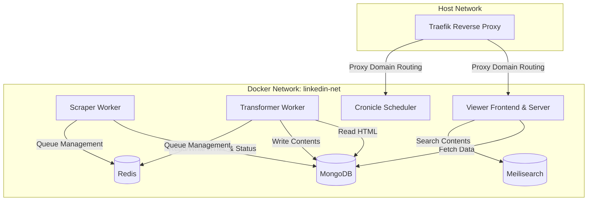

# 🗺️ Global Meta Skill & Project Architecture (SKILL.md)

This document serves as the **Global Meta Skill** for AI coding agents working on the LinkedIn Clipper project. It coordinates domain-specific skills, defines the overall project architecture, and enforces execution boundaries.

---

## 1. 📂 Agent Skill Directory Map

When taking on a task, identify the developmental context and activate/reference the corresponding skill file:

| Development Context | Target Skill File | Key Rules & Focus |
|:---|:---|:---|
| **Site Crawlers & Pipeline** | [.agents/skills/DevelopSitesSkills.md](file:///.agents/skills/DevelopSitesSkills.md) | Bronze ➡️ Silver pipeline stages, extending base classes, `IConverter` implementation, saving DB connections in `finally` blocks. |
| **Database & Indices** | [.agents/skills/DatabaseSkills.md](file:///.agents/skills/DatabaseSkills.md) | MongoDB & Redis schema rules, mandatory database indexes, query performance, and indexing standards. |
| **HTML/Scraping Debugging** | [.agents/skills/HtmlDebuggingSkills.md](file:///.agents/skills/HtmlDebuggingSkills.md) | Using `HtmlDebugger` utility, dumping raw vs minified HTML, and troubleshooting extraction issues. |
| **Global Environment & Orchestration** | **This Document (`SKILL.md`)** | Orchestrating services, Docker networks, CLI diagnostics, testing workflows, and general agent behavior. |

---

## 2. 🏗️ Global System Architecture

The Clipper application relies on a microservice-style infrastructure orchestrated via Docker Compose.



### 2.1 Domain-Based Host Routing (Traefik)
- Infrastructure services (MongoDB, Redis, Meilisearch) **must not expose ports directly to the host machine**.
- Traffic to user-facing dashboards (Viewer, Cronicle) is routed through Traefik using custom local hostnames (e.g., `*.localhost` or `*.nip.io`).

---

## 3. ⚙️ Execution & Testing Workflows (Strict Rules)

To ensure consistency and avoid library or runtime mismatches (especially for browser-based automation tools like Playwright):

### 3.1 Docker-Centric Development & Debugging
- **Never** run scraping or transformation scripts directly on the host. Always run them inside containers with volume mounting:
  ```bash
  docker compose -p linkedin run --rm --user $(id -u):$(id -g) -v $(pwd):/app -v /app/node_modules worker npx ts-node src/crawler/cli-list.ts --site geeknews
  ```
- **Volume Mount Guideline**: When mounting the workspace (`-v $(pwd):/app`), the host's `node_modules` must not overwrite the container's version. Always append `-v /app/node_modules` to preserve the container's built dependencies.

### 3.2 Testing Environments
- **Unit/Integration Tests**: Run using the testing compose environment to isolate DB/Redis states.
- **Production Verification**: When validating production images, run **without** volume mounts after triggering a rebuild:
  ```bash
  docker compose build worker && docker compose run --rm worker npm test
  ```

---

## 4. 📝 Code Quality & Integrity Principles

Every code change must adhere to the following strict engineering guidelines:

1. **Explicit Typing (No `any`)**: Declare explicit TypeScript interfaces and return types for all public and internal methods.
2. **Resource & Lifecycle Management**: Database connections, browser pools, and file handles must always be closed inside a `finally` block to prevent leaks and process hangs.
3. **No Silent Failures**: Every `catch` block must log the error context using a dedicated logging utility (like `Logger.warn`).
4. **Centralized Config**: Never reference `process.env` directly in application logic. Inject configurations via the `AppConfig` class constructor.
5. **Git Commit Automation**: After making valid modifications, always run `scripts/agents/commit-changes.sh` immediately to record progress.
