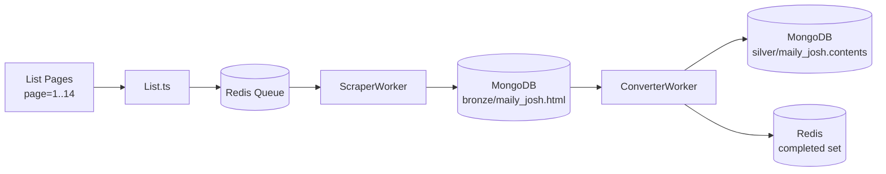

# 📰 조쉬의 뉴스레터 (Maily Josh)

**Site Identifier:** `maily_josh`

**URL:** [https://maily.so/josh](https://maily.so/josh)

**RSS Feed:** [https://maily.so/josh/feed](https://maily.so/josh/feed)

## 📋 개요

`maily.so` 플랫폼에서 운영되는 조쉬의 뉴스레터 스크래퍼입니다.
AI, 비즈니스, 프로덕트에 관한 인터뷰와 인사이트를 주로 다룹니다.

- **작성자:** Josh (조쉬)
- **발행 주기:** 매주 수요일
- **주제:** AI, 비즈니스, 프로덕트, 인터뷰
- **카테고리:** 비즈니스 인사이트, 창업가 스토리, HOW I AI PODCAST

## 🏗 아키텍처



## 🔄 데이터 흐름

1. **List** (`task app:crawler:site SITE=maily_josh CMD=list`)
   - 페이지네이션 API (`https://maily.so/josh?page=N&controller=...`) 호출
   - 각 페이지에서 `<a class="post-card-list-item">` 링크 추출
   - 중복 제거 후 URL을 Redis Queue에 Push
   - 콘텐츠가 없는 페이지(빈 페이지)까지 도달하면 중단
   - 기본 14페이지, 총 ~139개 아티클

2. **ScraperWorker** (자동 실행)
   - Redis Queue에서 URL Pop
   - `scrapeHttpFetch`로 HTTP 요청
   - HTML을 MongoDB `bronze/maily_josh.html`에 저장
   - Convert Queue에 Push

3. **ConverterWorker** (자동 실행)
   - `MailyJoshConverter.convertHtmlToMarkdown()` 호출
   - HTML → Markdown 변환
   - `TargetLoader.buildDocument()`로 데이터 구조화
   - MongoDB `silver/maily_josh.contents`에 저장
   - URL 상태를 'completed'로 마크

## 🚀 사용법

```bash
# 게시글 목록 수집 (페이지네이션)
task app:crawler:site SITE=maily_josh CMD=list               # 전체 페이지 수집
task app:crawler:site SITE=maily_josh CMD=list PAGE=1-5      # 1-5페이지만 수집
task app:crawler:site SITE=maily_josh CMD=list LIST_SLACK=3  # 페이지 간 간격 3초

# URL 큐 복구
task app:crawler:site SITE=maily_josh CMD=refresh-urls

# 실버 레이어 재가공
task app:crawler:site SITE=maily_josh CMD=refresh-silver

# 테스트 실행
npx ts-node tests/sites/maily/josh/Converter.test.ts
```

## 📄 파일 구조

```
src/crawler/sites/maily/josh/
├── site.config.ts         # SiteDescriptor 설정
├── Converter.ts           # HTML → Markdown 변환
├── List.ts                # RSS 기반 URL 수집
├── README.md              # 이 파일

tests/sites/maily/josh/
├── Converter.test.ts      # 유닛 테스트
└── fixtures/
    ├── article.html       # 테스트용 HTML 데이터
    └── rss.xml            # 테스트용 RSS 데이터

Taskfile.yml               # 루트 Task namespace 진입점
```

## 🔧 HTML 파싃 상세

### List (Pagination)
- `https://maily.so/josh?page=N&controller=spaces%2Fpages&action=home&space_url=josh` 호출
- `cheerio`로 `a.post-card-list-item` 요소 파싱
- 각 링크의 `href`와 `.font-bold` 텍스트(title) 추출
- 중복 URL 제거 (`Set` 활용)
- 아티클이 0개인 페이지까지 순회하며 중단
- ID 생성: `crypto.createHash('md5').update(url).digest('hex')`

### Converter (Article)
- **Title:** `<meta property="og:title">` 또는 `<title>` 태그
- **Category:** `<h2> <a href="/c/...">` 텍스트
- **Date:** `<meta property="article:published_time">` 또는 `YYYY.MM.DD` 패턴
- **View Count:** `조회 X.XXK` 텍스트
- **Content:** `<article class="post-body-narrow">` HTML → TurndownService로 Markdown 변환
