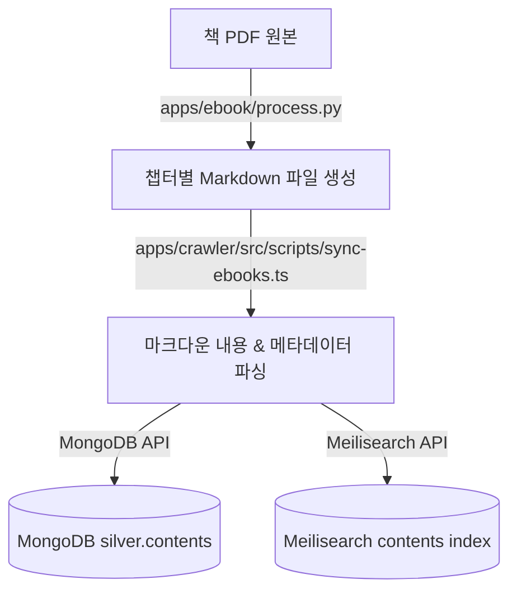

# Batch: 001–010

> Batched from 11 artifact(s) in range 001–010

---

## 001-integrate-ebook-service.plan

# [LLM Wiki Monorepo Restructuring & Ebook Integration Plan]

프로젝트의 지속적인 확장성(LinkedIn Jobs, 메일링 리스트, 기술 서적 통합 등)을 확보하고 이종 언어(TypeScript, Python) 간 격리와 공통 모듈 공유를 완벽히 지원하기 위해, 전체 프로젝트를 **서비스 중심 모노레포(Monorepo) 구조**로 리팩토링하고 파이썬 기반 `ebook` 서비스를 통합하는 계획입니다.

## User Review Required

> [!IMPORTANT]
> - **대대적인 코드 이동**: 모든 TypeScript 소스(`src/`)가 `apps/` 및 `packages/` 하위로 분산 이동합니다. 임포트 경로 오류를 방지하기 위해 TypeScript Path Aliases(예: `@wiki/database`) 설정을 도입합니다.
> - **데이터 저장소 통합**: 기존 `ebook/data`에 분산되어 있던 대용량 PDF 책 파일들은 프로젝트 루트의 공통 데이터 폴더인 `data/ebook/` 하위로 일괄 이관 및 통합합니다. 이를 통해 Git 관리 누락 방지와 디렉토리 일관성을 유지합니다.
> - **Docker Compose 프로파일 적용**: `ebook` 서비스는 상시 구동이 필요 없는 배치성 작업이므로, Docker Compose의 `profiles: ["ebook"]` 설정을 도입합니다. 명시적으로 프로파일을 호출할 때만 구동되도록 제어하여 로컬 시스템 자원을 절약합니다.
> - **단계적 마이그레이션**: 서비스 중단을 방지하고 오류 추적을 쉽게 하기 위해 리팩토링은 `1) 뼈대 구축 및 공통 패키지 추출 -> 2) TS 서비스 분리 -> 3) Python ebook 통합 -> 4) Docker & 빌드 환경 복원` 순으로 단계별 진행합니다.

---

## Proposed Directory Structure

마이그레이션 완료 후 최종 구조는 다음과 같습니다.

```text
/workspace/scraper/
├── apps/                        # 독립 실행 서비스 (Applications)
│   ├── crawler/                 # TS 크롤러 (Scraper, Converter, Indexer Workers)
│   │   ├── src/
│   │   ├── package.json
│   │   └── tsconfig.json
│   ├── viewer/                  # 웹 뷰어 및 API 서버 (Vite Vue + Express)
│   │   ├── src/
│   │   ├── package.json
│   │   └── tsconfig.json
│   └── ebook/                   # [Python] 기술 서적 PDF/EPUB 파서 및 분석기
│       ├── src/                 # 파이썬 소스 코드 (process.py, translate.py 등)
│       └── pyproject.toml       # uv 의존성 설정
│
├── packages/                    # 공통 라이브러리 (Shared Packages)
│   ├── database/                # MongoDB, Redis, Meilisearch 커넥터 및 스키마
│   │   └── index.ts
│   ├── config/                  # 애플리케이션 공통 환경설정 및 로더
│   │   └── index.ts
│   └── utils/                   # 날짜, 포맷팅, 파일 핸들링 등 공통 유틸리티
│
├── data/                        # 프로젝트 공통 데이터/임시 저장소
│   └── ebook/                   # 원본 기술 서적 PDF 저장소 (.gitignore 대상)
│
├── compose.yml                  # 모노레포 통합 컨테이너 오케스트레이션
├── package.json                 # 모노레포 루트 package.json (npm workspaces 정의)
└── tsconfig.json                # 루트 TS 설정 (Path Aliases 공통 상속용)
```

---

## Proposed Changes

### 1단계: 모노레포 구조 기틀 및 공통 패키지 구성
* **패키지 분리**:
  * `packages/database/` 생성 후 `src/database/`에 있던 MongoDB, Redis, Meilisearch 파일 이관 및 단일 진입점(`index.ts`) 제공.
  * `packages/config/` 생성 후 `src/config/` 내부 설정 로더 이관.
* **루트 설정 변경**:
  * 루트 `package.json`을 수정하여 `npm workspaces` 적용 (`"workspaces": ["apps/*", "packages/*"]`).
  * 루트 `tsconfig.json`에 `compilerOptions.paths` 적용 (예: `@wiki/database`, `@wiki/config` 정의).

### 2단계: TypeScript 서비스 분리 (`apps/crawler`, `apps/viewer`)
* **`apps/crawler` 구성**:
  * `src/crawler/`에 있던 모든 로직을 `apps/crawler/src/` 아래로 이관.
  * 독립적인 실행을 위한 `apps/crawler/package.json` 및 `tsconfig.json` 정의.
* **`apps/viewer` 구성**:
  * `src/viewer/` 아래에 있던 뷰어 프론트엔드 및 API 서버 코드를 `apps/viewer/`로 이관.
  * 프론트엔드(`apps/viewer/frontend/`)와 백엔드 API 서버 빌드 경로 조절.

### 3단계: 파이썬 서적 처리 서비스 통합 (`apps/ebook`)
* **소스 이관 및 데이터 통합**:
  * `../ebook` 레포지토리의 소스 코드(`process.py`, `translate.py`, `books.json`, `pyproject.toml`, `uv.lock`)를 `apps/ebook/` 아래로 복사.
  * `../ebook/data/` 내부의 원본 PDF/EPUB 등 책 파일들은 `scraper/data/ebook/` 아래로 일괄 이관.
* **동기화 파이프라인 추가**:
  * `apps/ebook/`에서 파이싱이 완료되어 생성된 Markdown 파일을 MongoDB에 주입하고 Meilisearch에 색인하는 TS 기반 스크립t(`apps/crawler/src/scripts/sync-ebooks.ts`) 추가.

### 4단계: Docker & 빌드 오케스트레이션 개편
* **Dockerfile 조정**:
  * `docker/worker/` 밑의 `scraper`, `converter`, `indexer` Dockerfile들의 빌드 컨텍스트 및 복사 경로 수정.
  * `docker/worker/ebook/Dockerfile` 신규 작성하여 파이썬 및 `uv` 구동 환경 구축.
* **compose.yml 수정**:
  * `ebook` 서비스를 구성하고 `profiles: ["ebook"]`을 적용하여 자원 격리.
  * 볼륨 마운트 (`./apps/ebook:/app` 및 `./data/ebook:/app/data`) 및 MongoDB 공유 네트워크 조인.
  * 기존 `viewer`, `worker` 등의 빌드 컨텍스트 경로 수정.

---

## Verification Plan

### Automated Tests
1. 모노레포 의존성 설치 및 린트/컴파일 검증:
   ```bash
   npm install
   npm run build --workspaces
   ```
2. 개별 서비스 Docker 빌드 테스트 (ebook은 프로파일과 함께 테스트):
   ```bash
   docker compose build crawler
   docker compose build viewer
   docker compose --profile ebook build ebook
   ```

### Manual Verification
1. `docker compose up`으로 전체 스택 구동 후, `viewer` 웹 브라우저가 정상 로드되는지 확인 (ebook은 실행되지 않는 상태).
2. `docker compose --profile ebook run --rm ebook uv run python process.py --help` 명령으로 임시 실행이 정상 구동되는지 확인.
3. `apps/ebook` 컨테이너 내에서 샘플 책 마이그레이션이 동작하고 Markdown이 MongoDB와 Meilisearch에 잘 적재되는지 위키 UI를 통해 조회 테스트.

---

## 001-integrate-ebook-service.spec

# Specs: Ebook 수집 및 동기화 파이프라인 (Ebook Integration Spec)

## 1. 개요 및 목적 (Overview & Goals)
- **기능 설명**: 기존 파이썬 기반 `../ebook` 서적 추출 및 변환 파서를 모노레포(`apps/ebook`)로 통합하고, 추출된 마챕터별 Markdown 데이터를 `apps/crawler` 내의 TypeScript 동기화 CLI(`sync-ebooks.ts`)를 통해 프로젝트 내 공통 데이터 저장소(MongoDB & Meilisearch)에 동기화합니다.
- **해결하려는 문제**: 파이썬 환경에서 DB나 검색엔진에 직접 연결을 구축하여 분산되는 것을 차단하고, 텍스트 가공(Python)과 데이터 적재/색인(TypeScript) 역할을 명확하게 분리하여 아키텍처의 일관성을 확보합니다.

## 2. 입출력 데이터 명세 (Data Specification)
- **입력 데이터 (Input Data)**:
  - **포맷**: 책의 챕터 단위로 분할 및 번역된 정제 Markdown 파일 (.md)
  - **경로**: `data/ebook/output/{BookName}/{ChapterIndex}. {ChapterTitle}.md`
  - **필수 속성**: 파일 내용의 Markdown 본문 및 파일 경로 구조를 이용한 메타데이터 추출.
- **출력 데이터 (Output Data)**:
  - **포맷**: JSON Document
  - **저장 대상 데이터베이스**:
    - **MongoDB**: `silver.contents` 컬렉션
    - **Meilisearch**: `contents` 인덱스
  - **스키마 구조**:
    ```typescript
    interface EbookContentDocument {
      _id: string;          // 책 고유 식별자 + 파일 경로 등을 기반으로 생성된 MD5 해시 ID (255자 파일명 제약 방어)
      title: string;        // 챕터 제목
      bookName: string;     // 서적명 (상위 폴더 이름)
      rawMarkdown: string;  // 변환된 마크다운 원문 텍스트
      url: string;          // 로컬 식별용 가상 URL (예: `file:///data/ebook/output/...`)
      status: string;       // 동기화 상태 ('completed')
      synchronizedAt: Date; // 동기화 일시
    }
    ```

## 3. 파이프라인 흐름 (Data Flow / Pipeline Sequence)

책 PDF 파일이 파이썬 스크립트를 거쳐 마크다운 문서로 분할된 후, 최종적으로 데이터베이스와 인덱스에 적재되기까지의 흐름입니다.



## 4. 제약 사항 및 예외 규칙 (Constraints & Edge Cases)
- **식별자(ID) 생성 규칙**: 파일 경로가 길어지거나 특수문자, 한글 인코딩 문제가 발생할 경우 파일 시스템의 255자 경로명 한계(`ENAMETOOLONG`) 또는 Meilisearch 인덱싱 키 길이 제한에 부딪힐 수 있습니다. 이를 방어하기 위해 파일 상대 경로의 MD5 32자리 해시값을 고유 고정 길이 `_id`로 사용합니다.
- **개별 파일 예외 복원**: 수백 개의 마크다운 파일 중 일부 파일의 파싱 에러나 데이터가 비어 있는 결함이 발생하더라도, 전체 스크립트 실행이 중단되지 않고 해당 파일만 로그에 에러를 기록한 후 `try-catch`로 건너뛰어 다음 파일들을 계속 처리합니다.

---

## 002-document-system-alignment.plan

# Plan: AI-Assisted Coding 및 서비스 통합을 위한 문서 체계 정립 계획

기존 모노레포 개편 및 Ebook 서비스 마이그레이션이 완료됨에 따라, 전체 시스템의 개발 생명주기(SDLC)를 완성하고 AI 협업 효율성을 높이기 위해 `GOAL.md` 생성, `CHANGELOG.md` 업데이트, `docs/specs/` 내 Ebook 서비스 사양 명세화를 진행합니다.

## User Review Required
> [!NOTE]
> - `GOAL.md`에는 단기 마일스톤(Ebook 이관 및 DB 연동) 외에 LinkedIn Jobs 취합, 기술 메일링 리스트 취합, 트렌드 분석 리포팅 등 시스템의 장기 비전이 기술됩니다.
> - `CHANGELOG.md`에는 릴리즈 버전의 모노레포 개편 작업 이력이 요약되어 기록됩니다.

## Proposed Changes

### 1. 프로젝트 목표 및 로드맵 정의
- **`[MODIFY]`** `GOAL.md`: 프로젝트의 핵심 목표 및 이정표 로드맵 정의 (기존 구축 완료된 LinkedIn, 뉴스레터, Ebook 수집 단계를 '완료'로 수정하고, 검색 고도화 및 LLM 트렌드 분석 리포팅을 핵심 미래 목표로 재정립)


### 2. 프로젝트 변경 이력 관리
- **`[MODIFY]`** `CHANGELOG.md`: 기존 변경 이력에 모노레포 통합 마일스톤 완료 사항 릴리즈 내역으로 추가

### 3. Ebook 파이프라인 사양 구체화
- **`[NEW]`** `docs/specs/integrate-ebook-service.md`: `specs_template.md` 양식에 근거하여 파이썬 파서의 동작, 데이터 동기화(`sync-ebooks.ts`) 흐름, DB 적재 사양을 기록

### 4. Makefile 스크립트 실행 경로 수정
- **`[MODIFY]`** `scripts/utils/browser.mk`, `scripts/utils/meili.mk`, `scripts/utils/mongo.mk`, `scripts/utils/tests.mk`, `scripts/utils/worker.mk`: 레거시 `src/scripts` 경로를 모노레포 구조에 맞는 `apps/crawler/src/scripts`로 일괄 수정

### 5. AGENTS.md 내 자가 검증 규칙 보강
- **`[MODIFY]`** `AGENTS.md`: "Documentation Lifecycle Rules" 섹션에 코드/설정 변경 시 리뷰 문서 강제 작성 및 자가 검증 의무화 조항 명문화

### 6. Scraper/Converter/Indexer/TargetLoader Worker 데이터베이스 임포트 오류 수정
- **`[MODIFY]`** `apps/crawler/src/workers/ScraperWorker.ts`, `apps/crawler/src/workers/ConverterWorker.ts`, `apps/crawler/src/workers/IndexerWorker.ts`, `apps/crawler/src/workers/TargetLoader.ts`: 레거시 및 별칭(alias) 경로 대신 환경에 구애받지 않는 물리적 상대경로(`../../../../packages/database/mongo` 및 `meili`)로 데이터베이스 임포트 경로를 수정하여 빌드 안정성 확보


### 7. docs/reviews/ 하위 아티팩트 복사 및 보존 규칙 수립
- **`[NEW]`** `docs/reviews/document-system-alignment.task.md`, `docs/reviews/document-system-alignment.walkthrough.md`: 에이전트 전용 아티팩트 내용을 실제 프로젝트 디렉토리에 `{plan-name}.task.md` 및 `{plan-name}.walkthrough.md` 형태로 복사하여 보존
- **`[MODIFY]`** `AGENTS.md`: "Documentation Lifecycle Rules" 및 "Engineering Rules"에 버그픽스(Bugfix) 발생 시의 구조적 해결 원칙 및 이력 명시 의무화 반영
- **`[MODIFY]`** `scripts/sites/*.mk`: 9개 사이트별 하위 Makefile 내의 레거시 `src/crawler/` 실행 경로를 모노레포 구조에 맞는 `apps/crawler/src/`로 일괄 버그픽스


---

## Verification Plan

### Automated Tests
- 없음 (문서 작성 작업이므로 린트 및 마크다운 깨짐 여부 수동 확인)

### Manual Verification
1. 작성 완료된 모든 마크다운 파일들의 상대 링크 작동 여부 확인 (`docs/templates/` 및 실제 생성 파일 간의 링크 정합성)
2. `scripts/agents/commit-changes.sh` 실행 시 정상적으로 문서 추가 변경 내역이 Git 커밋으로 반영되는지 확인

---

## 003-add-crawler-profile.plan

# Plan: add-crawler-profile

`apps/crawler/docker/worker/compose.yml` 파일 내에 정의된 크롤러 관련 서비스들에 `crawler` 프로필(profile)을 추가하는 계획입니다.

## User Review Required
> [!IMPORTANT]
> - `worker`, `scraper`, `converter`, `indexer` 서비스에 `crawler` 프로필을 추가하여, `docker compose --profile crawler up` 형태로 크롤러 핵심 서비스 그룹을 일괄 실행하거나 관리할 수 있도록 합니다.

## Proposed Changes

### Docker Compose Configuration
- **`[MODIFY]`** `apps/crawler/docker/worker/compose.yml`:
  - `worker` 서비스의 profiles 항목 아래에 `- crawler` 추가
  - `scraper` 서비스의 profiles 항목 아래에 `- crawler` 추가
  - `converter` 서비스의 profiles 항목 아래에 `- crawler` 추가
  - `indexer` 서비스의 profiles 항목 아래에 `- crawler` 추가

---

## Verification Plan

### Manual Verification
- 파일 변경 후 문법적 이상 유무 확인:
  - `docker compose -f apps/crawler/docker/worker/compose.yml config` 명령어를 통해 프로필 추가 설정이 올바르게 분석되는지 확인합니다.

---

## 004-move-ebook-docker-configs.plan

# Plan: move-ebook-docker-configs

`apps/crawler/docker/worker/` 하위에 위치하던 `ebook` 서비스의 Dockerfile 및 docker-compose 설정을 `apps/ebook/docker/` 디렉토리 하위로 이동하고, 이에 따라 볼륨 및 빌드 컨텍스트 경로를 알맞게 조정하는 계획입니다.

## User Review Required
> [!IMPORTANT]
> - 기존 `apps/crawler/docker/worker/compose.yml`의 `ebook` 서비스 설정이 삭제되고, `apps/ebook/docker/compose.yml`로 완전히 격리 분리됩니다.
> - `apps/ebook/docker/Dockerfile`은 루트 컨텍스트에서 빌드하는 사양이 유지되도록 경로가 패치됩니다.

## Proposed Changes

### 1. Ebook Service Configurations
- **`[NEW]`** `apps/ebook/docker/Dockerfile`: 기존 `apps/crawler/docker/worker/ebook/Dockerfile`을 복사/이관
- **`[NEW]`** `apps/ebook/docker/compose.yml`: 신규 compose 파일 생성 및 `ebook` 서비스 구성 정의 (빌드 컨텍스트 및 볼륨 마운트 경로 재조정)
- **`[DELETE]`** `apps/crawler/docker/worker/ebook/Dockerfile`: 기존 레거시 Dockerfile 제거
- **`[MODIFY]`** `apps/crawler/docker/worker/compose.yml`: 기존 `ebook` 서비스 정의 블록 삭제

---

## Verification Plan

### Manual Verification
- docker compose config 유효성 검사:
  - `docker compose -f apps/ebook/docker/compose.yml config` 명령어가 구문 오류 없이 정상적으로 실행되는지 확인합니다.

---

## 005-align-viewer-docker-configs.plan

# Plan: align-viewer-docker-configs

`apps/viewer/docker/` 하위의 빌드 컨텍스트를 `apps/crawler/`와 동일한 스타일로 모듈 루트(`..`) 기준의 일관된 상대 경로 구조로 정렬하고, `apps/viewer`가 `src/` 구조로 개편 및 `frontend`가 `src/frontend`로 이동함에 따른 소스 및 실행 파일 참조 경로를 일괄 정형화하는 계획입니다.

## User Review Required
> [!IMPORTANT]
> - `viewer-fe` 서비스의 빌드 컨텍스트가 프로젝트 루트 전체에서 `apps/viewer` 모듈 루트로 단축 변경됩니다.
> - `frontend` 디렉토리가 `src/frontend`로 이동함에 따라 모든 Dockerfile 내의 소스 복사 경로 및 빌드 스크립트가 이에 맞춰 수정됩니다.
> - `server.ts`와 `mcp-entry.ts`가 각각 `src/api/server.ts`, `src/mcp/mcp-entry.ts`로 이동함에 따라 `package.json` 및 `compose.yml`의 커맨드가 갱신됩니다.

## Proposed Changes

### 1. Package Configuration
- **`[MODIFY]`** `apps/viewer/package.json`:
  - `main`, `scripts.start`, `scripts.mcp` 경로를 각각 `src/api/server.ts`, `src/mcp/mcp-entry.ts`로 변경

### 2. Docker Compose Configuration
- **`[MODIFY]`** `apps/viewer/docker/compose.yml`:
  - `viewer-fe` 서비스의 빌드 경로 수정:
    - `context: ../../../` ➡️ `context: ..`
    - `dockerfile: apps/viewer/docker/fe/Dockerfile` ➡️ `dockerfile: docker/fe/Dockerfile`
  - `viewer-api` 및 `viewer-mcp` 서비스의 `command` 인자를 각각 `src/api/server.ts`, `src/mcp/mcp-entry.ts`로 변경

### 3. Dockerfiles
- **`[MODIFY]`** `apps/viewer/docker/fe/Dockerfile`:
  - `frontend` 경로를 `src/frontend`로 변경하고 `--prefix` 옵션 경로 수정
- **`[MODIFY]`** `apps/viewer/docker/api/Dockerfile`:
  - `frontend` 경로를 `src/frontend`로 수정하고 CMD 지시자를 `src/api/server.ts`로 변경
- **`[MODIFY]`** `apps/viewer/docker/mcp/Dockerfile`:
  - `frontend` 경로를 `src/frontend`로 수정하고 CMD 지시자를 `src/mcp/mcp-entry.ts`로 변경

---

## Verification Plan

### Manual Verification
- docker compose config 검증:
  - `docker compose --profile viewer config` 실행하여 빌드 컨텍스트 및 도커파일 매핑 무결성 검증
- docker compose build 검증:
  - `docker compose --profile viewer build` 빌드를 수행하여 프론트엔드 및 백엔드 이미지가 오류 없이 컴파일 및 레이어 생성되는지 검증

---

## 006-decouple-fe-be-services.plan

# Plan: decouple-fe-be-services

Vite 프론트엔드와 Express API 및 MCP 백엔드 서버를 완전히 물리적으로 디커플링(Decoupling)하여 백엔드 빌드 환경에서 불필요한 프론트엔드 빌드 종속성 및 정적 파일 호스팅을 걷어내고, 최근 `src/` 구조 이동으로 발생한 TypeScript 임포트 참조 오류(Bugfix)를 해결하는 계획입니다.

## User Review Required
> [!IMPORTANT]
> - `viewer-api` 및 `viewer-mcp` 서비스의 Dockerfile에서 프론트엔드 종속성 설치 및 빌드 과정이 전면 제거되어 빌드 효율이 향상됩니다.
> - `server.ts`에서 Express가 더 이상 `dist` 폴더를 정적 파일로 서빙하지 않습니다. (Traefik에서 이미 `viewer-fe` 서비스로 정적 페이지 트래픽을 처리하고 있으므로 기능에 문제가 없습니다.)
> - **[Bugfix]** `server.ts`, `mcp-entry.ts`, `mcp.ts` 의 임포트 경로를 재정렬하여 `src/` 이동 후 발생하던 `TSError` 컴파일 오류를 원천 해결합니다.

## Proposed Changes

### 1. Package & Source Import Path Restructuring (Bugfixes)
- **`[MODIFY]`** `apps/viewer/src/mcp/mcp-entry.ts`:
  - `MongoDatabase` 임포트 경로 변경 (`./database/mongo` ➡️ `../database/mongo`)
- **`[MODIFY]`** `apps/viewer/src/api/server.ts`:
  - `database/mongo`, `database/meili`, `config/AppConfig`, `SiteRegistry` 경로를 `../` 상위 디렉토리 기준으로 수정
- **`[MODIFY]`** `apps/viewer/src/mcp/mcp.ts`:
  - `database/meili`, `SiteRegistry` 경로를 `../` 상위 디렉토리 기준으로 수정

### 2. Dockerfiles
- **`[MODIFY]`** `apps/viewer/docker/api/Dockerfile`:
  - 프론트엔드 의존성 및 에셋 빌드 단계 제거
- **`[MODIFY]`** `apps/viewer/docker/mcp/Dockerfile`:
  - 프론트엔드 의존성 및 에셋 빌드 단계 제거

### 3. Docker Compose Configuration (Bugfix)
- **`[MODIFY]`** `apps/viewer/docker/compose.yml`:
  - `viewer-api` 및 `viewer-mcp` 서비스의 구동 커맨드에 tsconfig 컴파일 지정 플래그(`--project /app/tsconfig.json`) 보강

---

## Verification Plan

### Manual Verification
- docker compose config 검증:
  - `docker compose --profile viewer config` 실행하여 문법 무결성 검증
- docker compose build & up 검증:
  - `docker compose --profile viewer build` 빌드를 수행하여 가벼운 API/MCP 빌드가 가동되는지 검증
  - `docker compose --profile viewer up -d` 를 통한 컨테이너 정상 구동 여부 확인

---

## 007-relocate-agents-tooling.plan

# Plan: relocate-agents-tooling

에이전트 이력 덤프, 룰 압축, 검증 등 AI 에이전트 인프라 관련 도구들(`apps/crawler/src/tools/agents/`)을 모노레포 구조 상위 모듈인 `apps/agents/`로 완전히 격리 이관하여 독립된 의존성과 관리 경로를 갖추게 하는 계획입니다.

## User Review Required
> [!IMPORTANT]
> - 에이전트 도구들의 물리적 경로가 `apps/crawler/src/tools/agents/`에서 `apps/agents/`로 이관됩니다.
> - `rules.ts` 등 스크립트 내부의 파일 시스템 탐색 경로가 이관된 경로 기준으로 최적화 수정됩니다.

## Proposed Changes

### 1. Relocate Agent Tooling Files
- **`[NEW]`** `apps/agents/` 디렉토리:
  - `agent_adapter.ts`, `rules.ts`, `sessions.ts`, `usage.ts` 파일 이관 수용
- **`[NEW]`** `apps/agents/tsconfig.json`:
  - 독립된 TypeScript 컴파일 및 실행을 보장하기 위한 tsconfig 파일 정의
- **`[DELETE]`** `apps/crawler/src/tools/agents/` 디렉토리:
  - 기존 레거시 경로의 파일 삭제

### 2. Script Paths Restructuring
- **`[MODIFY]`** `apps/agents/rules.ts`:
  - 변경된 상대 경로에 맞게 내부의 rulesDir, transcriptsAgyDir, transcriptsDir 경로 수정 (`../../` 기준)
- **`[MODIFY]`** `scripts/utils/agents.mk`:
  - `dump`, `compress-rules`, `usage` 등의 명령어 타겟 경로를 `apps/agents/...` 로 갱신

---

## Verification Plan

### Manual Verification
- 에이전트 덤프 유효성 검사:
  - `make agents-dump` 실행하여 `rules_compact.txt` 압축 및 트랜스크립트 덤프가 예외 없이 완벽하게 정상 구동하는지 확인합니다.

---

## 008-align-sites-tsconfig-path.plan

# Plan: align-sites-tsconfig-path

사이트별 스크립트 실행 Makefile에서 중복 선언되어 환경 변환 오류(Bugfix)를 유발하던 CLI 인자 `--project /app/tsconfig.json`을 일괄 제거하고, 공통 환경변수 `TS_NODE_PROJECT`로 단일화하여 동작의 안전성을 높이는 계획입니다.

## User Review Required
> [!IMPORTANT]
> - 모든 사이트 스크립트 실행 Makefile(`scripts/sites/*.mk`)의 `ts-node` 호출부에서 `--project` 매개변수가 전면 제거됩니다.
> - `environments.mk`에 지정된 환경변수 `-e TS_NODE_PROJECT=/app/tsconfig.json`을 통해 컴파일러의 경로 탐색이 안전하게 일원화됩니다.

## Proposed Changes

### 1. Site Makefiles CLI Refactoring
- **`[MODIFY]`** `scripts/sites/` 하위의 모든 `.mk` 파일 (9개):
  - `npx ts-node --project /app/tsconfig.json`을 `npx ts-node`로 일괄 축소 정비

---

## Verification Plan

### Manual Verification
- 사이트 리스트 덤프 테스트:
  - `make list` 실행하여 `gpters_news` 등이 TypeScript 컴파일 오류 없이 정상적으로 실행되는지 검증합니다.

---

## 009-remove-workspace-mount.plan

# Plan: remove-workspace-mount

사이트별 스크립트 실행 Makefile에서 호스트 디렉토리를 런타임에 덮어씌워 파일 시스템의 불완전성을 초래하던 `$(WORKSPACE_MOUNT)` 수동 마운트 설정을 전면 배제하고, 이미 빌드된 도커 이미지 내부의 온전한 형상 기준으로 안정적으로 가동(Bugfix)시키는 계획입니다.

## User Review Required
> [!IMPORTANT]
> - 모든 사이트 스크립트 실행 Makefile(`scripts/sites/*.mk`)의 `docker compose run` 구문에서 `$(WORKSPACE_MOUNT)` 옵션이 전면 삭제됩니다.
> - 이미지 빌드 시 복사된 `tsconfig.json` 및 `packages/` 등 루트 자원을 온전히 활용하여 컴파일러 경로 탐색의 안전성을 회복합니다.

## Proposed Changes

### 1. Remove Volume Mount Bindings from CLI Actions
- **`[MODIFY]`** `scripts/sites/` 하위의 모든 `.mk` 파일 (9개):
  - `$(WORKSPACE_MOUNT)` 매개변수를 전면 삭제하여 이미지 내부 경로가 덮어씌워 지지 않도록 차단
- **`[MODIFY]`** `scripts/environments.mk`:
  - `WORKSPACE_MOUNT` 변수 정의부 제거

---

## Verification Plan

### Manual Verification
- 사이트 리스트 덤프 테스트:
  - `make list` 실행하여 `gpters_news` 등이 `TS5083` 오류 없이 도커 이미지 내부 상태로 안전하게 가동 및 완수되는지 검증합니다.

---

## 010-translate-chapter-3.plan

# Plan: Chapter 3 번역 및 대조식 학습 문서 구성

이 계획서는 Beyond Vibe Coding의 Chapter 3 문서를 한국어 대조식 번역 문서로 가공하고 최하단에 복습용 질문 10문항을 추가하기 위한 작업 계획입니다.

## User Review Required
> [!IMPORTANT]
> - 이 작업은 한국어 학습자를 위한 원어-번역어 대조식 가공 작업으로, 기존 파일과 별도로 `_translated.md` 접미사를 가진 새 파일로 생성됩니다.
> - AI/ML 핵심 전문 용어를 번역 시 원어 병기하고 단락 직후 `[용어 해설]`을 구성합니다.

## Proposed Changes

### 1. Document Translation & Restructuring
- **`[NEW]`** `/home/ejpark/workspace/scraper/data/ebook/output/Beyond Vibe Coding/3. The 70% Problem AI-Assisted Workflows That Actually Work_translated.md`: 
  - 각 단락별 원문, 번역문, 용어 해설 배치
  - 최하단에 Chapter 3 핵심 내용을 담은 복습용 10문항의 질문 및 답변 생성

---

## Verification Plan

### Manual Verification
- 생성된 번역 문서의 단락 매칭성 검증
- 마크다운 문법 렌더링에 오류가 없는지 및 용어 해설 누락 확인
- 10개의 복습용 질문과 답변이 포함되었는지 최종 검토

---

