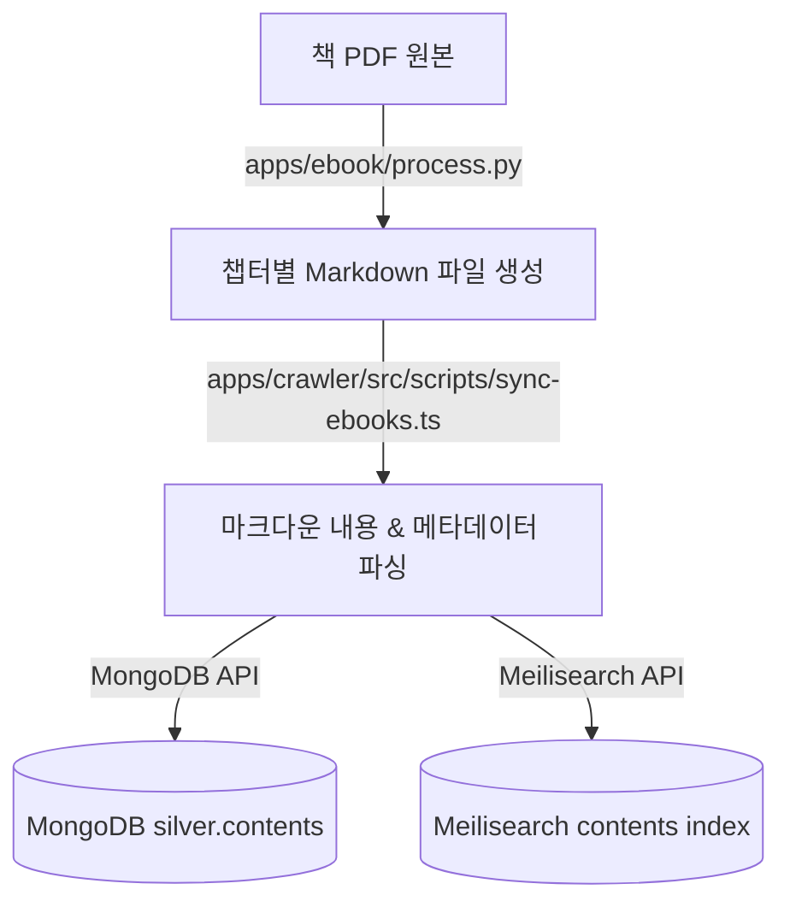

# Specs: Ebook 수집 및 동기화 파이프라인 (Ebook Integration Spec)

## 1. 개요 및 목적 (Overview & Goals)
- **기능 설명**: 기존 파이썬 기반 `../ebook` 서적 추출 및 변환 파서를 모노레포(`apps/ebook`)로 통합하고, 추출된 마챕터별 Markdown 데이터를 `apps/crawler` 내의 TypeScript 동기화 CLI(`sync-ebooks.ts`)를 통해 프로젝트 내 공통 데이터 저장소(MongoDB & Meilisearch)에 동기화합니다.
- **해결하려는 문제**: 파이썬 환경에서 DB나 검색엔진에 직접 연결을 구축하여 분산되는 것을 차단하고, 텍스트 가공(Python)과 데이터 적재/색인(TypeScript) 역할을 명확하게 분리하여 아키텍처의 일관성을 확보합니다.

## 2. 입출력 데이터 명세 (Data Specification)
- **입력 데이터 (Input Data)**:
  - **포맷**: 책의 챕터 단위로 분할 및 번역된 정제 Markdown 파일 (.md)
  - **경로**: `data/ebook/output/{BookName}/{ChapterIndex}. {ChapterTitle}.md`
  - **필수 속성**: 파일 내용의 Markdown 본문 및 파일 경로 구조를 이용한 메타데이터 추출.
- **출력 데이터 (Output Data)**:
  - **포맷**: JSON Document
  - **저장 대상 데이터베이스**:
    - **MongoDB**: `silver.contents` 컬렉션
    - **Meilisearch**: `contents` 인덱스
  - **스키마 구조**:
    ```typescript
    interface EbookContentDocument {
      _id: string;          // 책 고유 식별자 + 파일 경로 등을 기반으로 생성된 MD5 해시 ID (255자 파일명 제약 방어)
      title: string;        // 챕터 제목
      bookName: string;     // 서적명 (상위 폴더 이름)
      rawMarkdown: string;  // 변환된 마크다운 원문 텍스트
      url: string;          // 로컬 식별용 가상 URL (예: `file:///data/ebook/output/...`)
      status: string;       // 동기화 상태 ('completed')
      synchronizedAt: Date; // 동기화 일시
    }
    ```

## 3. 파이프라인 흐름 (Data Flow / Pipeline Sequence)

책 PDF 파일이 파이썬 스크립트를 거쳐 마크다운 문서로 분할된 후, 최종적으로 데이터베이스와 인덱스에 적재되기까지의 흐름입니다.



## 4. 제약 사항 및 예외 규칙 (Constraints & Edge Cases)
- **식별자(ID) 생성 규칙**: 파일 경로가 길어지거나 특수문자, 한글 인코딩 문제가 발생할 경우 파일 시스템의 255자 경로명 한계(`ENAMETOOLONG`) 또는 Meilisearch 인덱싱 키 길이 제한에 부딪힐 수 있습니다. 이를 방어하기 위해 파일 상대 경로의 MD5 32자리 해시값을 고유 고정 길이 `_id`로 사용합니다.
- **개별 파일 예외 복원**: 수백 개의 마크다운 파일 중 일부 파일의 파싱 에러나 데이터가 비어 있는 결함이 발생하더라도, 전체 스크립트 실행이 중단되지 않고 해당 파일만 로그에 에러를 기록한 후 `try-catch`로 건너뛰어 다음 파일들을 계속 처리합니다.
