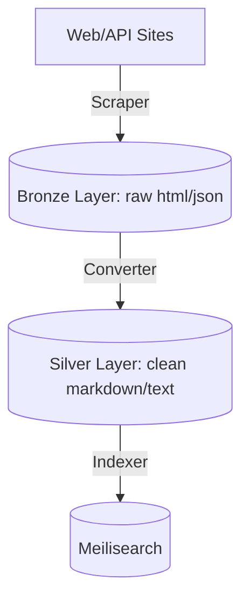

# Batch: 021–030

> Batched from 8 artifact(s) in range 021–030

---

## 021-translate-chapter-2.plan

# Plan - Beyond Vibe Coding Chapter 2 번역

이 계획서는 Beyond Vibe Coding 책의 2장(`2. The Art of the Prompt Communicating Effectively with AI.md`) 마크다운 파일을 한국어 대조식 번역 문서(`.en-ko.md`)로 가공하고 최하단에 복습용 질문 10문항을 추가하기 위한 작업 계획입니다.

## Proposed Changes

### 1. Manual/Sequential Translation by Agent (Method 1)
- **`[NEW]`** `/home/ejpark/workspace/scraper/data/ebook/output/Beyond Vibe Coding/2. The Art of the Prompt Communicating Effectively with AI.en-ko.md`:
  - 2장 본문 내용을 의미적 단락으로 분할 및 번역.
  - 각 단락 하단에 전문 용어(prompt engineering, docstring, reproducing, traceback 등)에 대한 `[용어 해설]` 배정.
  - 이미지 링크 및 표(Table) 구조 보존.
  - 최하단에 영-한 병기된 10문항의 복습용 질문 및 답변 생성.

---

## Verification Plan

### Manual Verification
- 에이전트가 생성한 번역 문서의 포맷 및 마크다운 대조 구조 검증.
- 복습용 질문 10문항의 영-한 완전 병기 및 내용 정확성 확인.
- 이미지 링크와 테이블 구조가 훼손되지 않았는지 최종 검토.

---

## 022-integrate-joplin-obsidian-exporter.plan

# Plan-0001: apps/exporter 통합 및 Joplin/Obsidian 내보내기 이식 계획서

본 문서는 `wikidocs-exporter` 프로젝트에서 사용되던 Joplin 및 Obsidian 파일 전송/내보내기 기능을 `scraper` 프로젝트의 독립 애플리케이션 `apps/exporter`로 이식하기 위한 상세 계획서입니다.

---

## 1. 개요 및 목적
- `wikidocs-exporter`의 핵심 내보내기(Export) 로직을 이식하여 수집된 컨텐츠를 Joplin 또는 Obsidian으로 쉽게 내보낼 수 있도록 합니다.
- `apps/exporter`는 `crawler`, `ebook`, `viewer` 등 기존 앱들과 독립된 단독 모듈로 동작합니다.
- 자체 `Dockerfile`, `compose.yml`, `Makefile`을 두어 독자적인 Docker 실행 환경을 제공하며, MongoDB 등의 공유 자원에 접근할 수 있도록 네트워크 및 인프라를 구성합니다.

---

## 2. 아키텍처 및 폴더 구조

`apps/exporter/` 하위에 다음과 같이 파일 구조를 생성합니다.

```
apps/exporter/
├── Dockerfile                   # Node.js TypeScript 실행용 Docker 이미지 정의
├── compose.yml                  # 독립 실행 및 scraper 네트워크 공유를 위한 docker-compose 설정
├── Makefile                     # build, run, test 등 로컬 및 Docker 실행 편의를 위한 명령어 정의
├── package.json                 # 의존성 정의
├── tsconfig.json                # TypeScript 빌드 설정
└── src/
    ├── index.ts                 # CLI 엔트리포인트 (MongoDB에서 스크랩된 컨텐츠를 읽어 export 실행)
    ├── export/
    │   ├── index.ts             # Exporter 모듈 통합 Export
    │   ├── joplin.ts            # Joplin Web Clipper API 연동 로직
    │   ├── obsidian.ts          # Obsidian Local REST API 연동 로직
    │   └── base.ts              # 파일명 정제(sanitizeFilename) 등 공통 유틸리티
    ├── generators/
    │   └── index.ts             # INDEX.md 생성을 위한 마크다운 포매터
    ├── types/
    │   └── index.ts             # Book, Chapter, ExportOptions 타입 정의
    └── utils/
        └── db.ts                # MongoDB 연결 및 데이터 조회 서비스 (기존 DB 구조 재사용)
```

---

## 3. 상세 수정 및 신규 생성 파일 계획

| File Path | Action | Details |
| :--- | :--- | :--- |
| `apps/exporter/package.json` | Create | TypeScript, ts-node, mongoose/mongodb, dotenv 등의 의존성 및 CLI 실행 스크립트 작성 |
| `apps/exporter/tsconfig.json` | Create | 모듈 분석 및 빌드 설정을 위한 tsconfig 정의 |
| `apps/exporter/Dockerfile` | Create | `node:20-alpine` 기반 빌드 및 CLI 작동 환경 설정 |
| `apps/exporter/compose.yml` | Create | `scraper_default` 네트워크 조인, 환경 변수(`.env`) 바인딩, CLI 볼륨 매핑 |
| `apps/exporter/Makefile` | Create | `make run-exporter`, `make build` 등의 명령어 정의 |
| `apps/exporter/src/types/index.ts` | Create | 내보내기에 필요한 Book, Chapter, ExportOptions 구조체 정의 |
| `apps/exporter/src/export/base.ts` | Create | 파일 이름 등 공통 문자열 정제(sanitizeFilename) 함수 정의 |
| `apps/exporter/src/generators/index.ts` | Create | index 마크다운 형식 생성(Obsidian, Joplin 스타일 개별 포맷팅) 구현 |
| `apps/exporter/src/export/joplin.ts` | Create | Joplin Web Clipper API(HTTP)를 활용한 폴더 및 노트 자동 생성 구현 |
| `apps/exporter/src/export/obsidian.ts` | Create | Obsidian REST API(HTTP/HTTPS)를 활용한 볼트(Vault) 내 마크다운 파일 전송 구현 |
| `apps/exporter/src/utils/db.ts` | Create | MongoDB의 `bronze` 또는 변환된 `silver/gold` 데이터를 조회하여 내보내기 객체(Book)로 변환해주는 DB 유틸 구현 |
| `apps/exporter/src/index.ts` | Create | CLI 인자 파싱(Export Target, API 토큰, Book ID/Title 입력) 및 실행 제어 루프 구현 |

---

## 4. 상세 연동 방식 및 인터페이스

### Joplin
- **포트 및 주소**: `http://localhost:41184` (로컬 Joplin 앱이 켜져 있어야 함)
- **API 토큰**: Joplin 웹 클리퍼 설정 화면에서 획득
- **동작**:
  1. `Wikidocs` 루트 폴더가 없으면 생성
  2. 서적명(Book Title) 폴더 생성 (루트 폴더 하위)
  3. 챕터별 노트를 해당 폴더 내에 생성
  4. 인덱스 노트 생성 (Joplin 내부 앵커 링크 연결 형식)

### Obsidian
- **포트 및 주소**: `http://127.0.0.1:27123` (HTTP) 또는 `https://127.0.0.1:27124` (HTTPS)
- **API 키**: Local REST API 플러그인 설정 화면에서 획득
- **동작**:
  1. `/WikiDocs/서적명/` 폴더 하위에 파일 쓰기 (`PUT /vault/WikiDocs/서적명/챕터명.md`)
  2. `INDEX.md` 파일 생성 (마크다운 상대경로 링크 형식)

---

## 5. 실행 및 검증 시나리오

1. **Docker 빌드 테스트**:
   - `docker compose -f apps/exporter/compose.yml build` 실행 테스트
2. **로컬 개발 실행 테스트**:
   - 로컬에 Joplin 또는 Obsidian을 실행
   - `apps/exporter` 내에서 CLI를 통해 특정 책을 선택해 내보내기 작동 여부 확인
   - 예: `docker compose -f apps/exporter/compose.yml run --rm exporter npm run start -- --target=joplin --token=... --book=...`

---

## 023-redis-namespace-restructuring.adr

# ADR 0001: Redis Queue & Completed Cache Namespace Restructuring

## Status
Accepted (2026-06-19)

## Context
Multiple crawler sites (`geeknews`, `dailydose_ds`, `gpters`, and `pytorch_kr`) were configured to share the same Redis cache set key (`completed_news`). This caused:
1. `seedCache()` inside `BaseListService` to skip MongoDB synchronization on subsequent crawls, because the shared set already had size > 0.
2. Inconsistent deduplication checks (`sismember`), leading to raw document queueing redundancy (redundantly pushing already crawled documents into scraper queues).
3. Harder key identification in multi-site dashboard monitoring.

## Decision
Adopt a unified, site-specific namespace layout for all Redis structures:
- **Queues**: `sites:${siteKey}:scrape:${priority}`
- **Completion Caches**: `sites:${siteKey}:completed`

Additionally, implement automatic legacy prefix translation in `BaseListService` and `BaseRefreshUrls` to ensure older site configs gracefully convert legacy keys (`completed_${siteKey}`) to the new namespace format.

## Consequences
- **Pros**:
  - Eliminates cross-site cache collision bugs.
  - Improves isolation; clearing a specific queue or completion cache does not affect other sites.
  - Simplifies regex scans in metrics pipelines (e.g. scanning `sites:*:scrape:*`).
- **Cons**:
  - Requires updating multiple core files (`ScraperWorker.ts`, `BaseListService.ts`, `server.ts`, etc.) and dashboards to handle the new key layout.
  - Active Redis caches must be re-seeded or migrated.

---

## 024-url-noise-cleansing-and-retroactive-migration.adr

# ADR 0002: URL Noise Cleansing & Retroactive Database Cleansing

## Status
Accepted (2026-06-19)

## Context
Trailing Korean grammatical particles (e.g. `를`, `에`, `은`, `는`) or their URL percent-encoded representations (e.g. `%EB%A5%BC`, `%EC%97%90`) were accidentally captured by body extractors during crawls. This resulted in malformed IDs (such as `1579%EB%A5%BC`) and caused subsequent scrape attempts to fail with HTTP 400 Bad Request.

Although the regex filter was added to `UrlUtils.stripTrackingParams` and parser rules were updated, historical crawled data with noise IDs still existed in MongoDB (`bronze.*.urls`). This metadata discrepancy caused:
- Mismatched duplication checks.
- Residual "Failed" state counts in database status logs.

## Decision
1. Implement a global database cleansing script (`src/scripts/clean_legacy_noise_ids.ts`) to programmatically loop through all registered site collections.
2. The script will identify all IDs matching `/.*[가-힣%].*/` in `bronze/${siteKey}.urls`.
3. Malformed noise documents will be deleted.
4. For each deleted document, a normalized clean version of the target document will be checked. If it does not exist, it will be upserted with status `new` and `pushedToRedis: false` to allow proper, clean re-crawling.

## Consequences
- **Pros**:
  - Automatically recovers all failed noise target links across all sites.
  - Keeps MongoDB collections clean and mathematically consistent with current ID mapping conventions.
  - Avoids manual database scripts or hardcoded shell queries.
- **Cons**:
  - Re-scheduling clean URLs increases temporary crawl queues, but it guarantees data completeness.

---

## 025-monorepo-restructuring-and-ebook-integration.adr

# ADR 0003: Monorepo Restructuring and Python Ebook Service Integration

## Status
Approved

## Context
프로젝트에 다양한 기술 정보 수집원(LinkedIn Jobs, Gmail 메일링 리스트, 기술 서적 등)이 추가되고 파이썬(Python) 기반의 기술 서적 변환 도구(`../ebook`)가 도입되면서 다음의 한계가 식별되었습니다.
1. **의존성 및 빌드 충돌**: 타입스크립트 기반 크롤러 빌드 환경과 파이썬 런타임/의존성 환경을 한 디렉토리에 혼용할 시 타입 컴파일러와 린터, 런타임 빌드 도구들의 상호 간섭이 우려되었습니다.
2. **자원 낭비**: 일회성 배치 형태인 서적 마이그레이션 도구가 상시 가동되는 백엔드 API/크롤러 워커들과 함께 시작될 때 시스템 자원(CPU, 메모리)의 비효율적 점유가 일어납니다.
3. **지식 베이스 연동 파편화**: 파이썬 결과물로 생성되는 Markdown 데이터를 타입스크립트 데이터 허브(MongoDB 및 Meilisearch)에 일관성 있게 밀어 넣어주는 표준 동기화 인터페이스가 부재했습니다.

## Decision
이 문제를 극복하고 장기적인 스케일링을 도모하기 위해 다음과 같은 아키텍처적 결정을 내렸습니다.

### 1. 서비스 중심 모노레포(Monorepo) 구조로의 전면 개편
프로젝트 루트를 다중 패키지 워크스페이스 형태로 리팩토링합니다.
- **`/apps`**: 독립적으로 기동되는 개별 애플리케이션 서비스들을 배치합니다.
  - `apps/crawler`: TS 기반 수집기, 컨버터, 인덱서 워커 및 동기화 스크립트 모음
  - `apps/viewer`: 웹 프론트엔드 및 API / MCP 서버
  - `apps/ebook`: 파이썬 기반 서적 파서 및 분석기
- **`/packages`**: 여러 서비스에서 재사용하는 공통 모듈을 추출하여 패키지화합니다.
  - `packages/database`: MongoDB, Redis, Meilisearch용 공통 드라이버 커넥터
  - `packages/config`: 공통 환경설정 로더
- **`/data`**: 프로젝트 전반에서 사용되는 파일 시스템 데이터 경로를 루트 `/data/` 하위로 일원화하고 하위 폴더별(예: `/data/ebook/`)로 통합합니다.

### 2. Docker Compose `profiles`를 통한 리소스 격리
- 파이썬 기반 `ebook` 컨테이너 서비스를 `compose.yml` 및 `docker/worker/compose.yml` 에 정의하되, `profiles: ["ebook"]` 속성을 부여합니다.
- 기본 웹/워커 스택 구동 시에는 ebook 컨테이너 빌드 및 런타임 부팅을 완전히 제외하여 로컬 자원을 아끼고, 필요할 때만 명시적 프로파일을 통해 일회성 실행할 수 있도록 제어합니다.

### 3. 타입스크립트 표준 데이터 동기화 파이프라인 수립
- 파이썬 스크립트가 뱉어내는 챕터별 Markdown 결과물을 데이터베이스에 밀어 넣어주는 TS 기반 동기화 CLI 스크립트([sync-ebooks.ts](file:///home/ejpark/workspace/scraper/apps/crawler/src/scripts/sync-ebooks.ts))를 작성합니다.
- 이 스크립트가 MongoDB 적재 완료 후 Redis `index_queue`에 작업 ID를 Push하면, 기존 크롤러용 `IndexerWorker`가 이 태스크를 꺼내 Meilisearch에 검색 연동을 완료하도록 하여 중복 설계 없이 파이프라인 시너지를 높였습니다.

## Consequences
- **의존성 격리**: 타입스크립트 환경(`package.json`, `tsconfig.json`)과 파이썬 환경(`pyproject.toml`, `uv.lock`)이 각자의 서비스 경계 내부로 완벽하게 은닉 및 격리되었습니다.
- **로컬 리소스 효율성**: 평소에 위키 검색 화면과 크롤러를 돌릴 때 파이썬 엔진이 실행되지 않으므로 컴퓨터 자원을 절약합니다.
- **RAG/검색 통합 단순성**: 모든 이종 지식(채용공고, 뉴스레터, 기술서적)이 단일 MongoDB Silver 및 Meilisearch 지식 베이스로 깔끔하게 수렴되어, 향후 RAG 개발 시 한 지점의 인덱스만 조회하여 연동하면 되도록 단순화되었습니다.

---

## 026-move-crawler-scripts-to-npm.adr

# ADR 0004: Move Crawler Scripts to NPM Scripts

## Status
Approved

## Context
- 현재 각 사이트별 스크래핑/마이그레이션 실행 단축 명령어가 프로젝트 루트의 `scripts/sites/*.mk` 디렉토리에 개별 Makefile 모듈 형태로 분산되어 관리되고 있습니다.
- 이는 모노레포 아키텍처 상 관심사 분리(Separation of Concerns) 측면에서 크롤러 앱(`apps/crawler`)의 독립성을 저해하고 결합도를 높이는 한계가 있습니다.
- 대안으로 (1) `apps/crawler/Makefile`로의 통합, (2) 각 사이트 소스 폴더 바로 옆에 Makefile 결합, (3) `package.json`의 npm 스크립트로 전환하는 방안이 논의되었습니다.

## Decision
- Node.js 생태계 표준 및 일관성 있는 CLI 인자 처리를 위해 **대안 3(`package.json`의 npm 스크립트 전환)**을 채택하기로 결정하였습니다.
- 개별 사이트별 빌드/실행 명령어들을 `apps/crawler/package.json` 내 스크립트(`scrape:<site>:<command>`)로 전부 이관 및 재구성합니다.
- 단, 도커(Docker Compose) 구동 편의성과 기존 CLI 호환성 유지를 위해 루트 `Makefile`에서는 이 npm 스크립트를 docker compose를 통해 원스톱으로 기동해주는 래퍼 규칙을 유지합니다.

## Consequences
- **장점 (Benefits)**:
  * 크롤러 앱 내에 실행/빌드 스크립트가 온전히 포섭되어 결합도가 낮아지고 모듈 격리가 강화됩니다.
  * Node.js 표준 인자 포워딩(`--`) 및 환경변수 주입을 활용하여 파라미터 전달 규칙이 균일해집니다.
  * 흩어져 있던 다수의 `.mk` 파일들이 단일 `package.json`에 수렴되어 파일 수가 줄어들고 형상 관리가 단순해집니다.
- **단점/감수할 점 (Costs / Drawbacks)**:
  * 호스트 OS 권한 우회 및 Docker 볼륨 설정을 감안하기 위해 루트 Makefile 레벨에서 `docker compose run`을 래핑하는 얇은 포워딩 타겟 코딩이 필요합니다.

---

## 027-pipeline-specification.spec

# Scraper & Converter Pipeline Specification

## 1. Overview
This project runs a multi-tier data processing pipeline to scrape web articles and jobs, convert them into clean markdown documents, and index them into a search engine.



---

## 2. Pipeline Tiers (Layers)

### 2.1. Bronze Layer (Raw Storage)
- **Purpose**: Act as an immutable, raw snapshot of crawled pages.
- **Collections**:
  - `bronze/${siteKey}.html`: Stores the raw HTML payload of target URLs.
    - Fields: `id`, `url`, `rawHtml`, `createdAt`
  - `bronze/${siteKey}.urls`: Manages tracking and dispatch state of urls.
    - Fields: `id`, `url`, `title`, `status` (`new` | `completed` | `failed`), `pushedToRedis` (`true` | `false`)

### 2.2. Silver Layer (Clean Metadata)
- **Purpose**: Structure raw documents into standardized schemas, extracting main text in Markdown format.
- **Collections**:
  - `silver/${siteKey}.contents`:
    - Fields: `id`, `title`, `url`, `publishedAt`, `content` (cleaned plaintext), `markdown` (cleaned markdown text), `updatedAt`

### 2.3. Gold Layer (Indexing)
- **Purpose**: Search indices optimized for user query parsing.
- **Indices**:
  - Meilisearch indexes populated from the Silver Layer.

---

## 3. ID Generation Protocol (Rule 1: Failure Handling)
To prevent Linux filesystem length limitations (`ENAMETOOLONG` max 255 chars), **all target document IDs must be deterministic, fixed-length hashes**:
- **Standard Hash**: MD5 (32-character hex string) based on the normalized URL.
- **Normalized URL Rule**: Strip tracking parameters (`utm_*`, etc.), standardise protocol (`https`), and exclude trailing slashes.

---

## 4. Cache & Queue Redis Key Schema
- **Queues**: `sites:${siteKey}:scrape:${priority}` (where priority = `high` | `medium` | `low`)
- **Completion Caches**: `sites:${siteKey}:completed` (Redis Set holding completed IDs)

---

## 5. URL Noise Cleansing Protocol
- **Noise Type**: Trailing Korean particles (`를`, `에`, `은`, `는` 등) and URL-encoded equivalents (e.g. `%EB%A5%BC`, `%EC%97%90`) resulting from parser errors on body extracts.
- **Normalization Action**: Applied inside `UrlUtils.stripTrackingParams(url)` using regular expression `/(?:%[0-9A-Fa-f]{2}|[가-힣]+)+$/`.
- **Retroactive Cleansing**: Managed via `src/scripts/clean_legacy_noise_ids.ts` to prune malformed IDs from DB and queue them again in clean form.


---

## 028-integrate-exporter-into-viewer.plan

# 📚 [Plan] Exporter 모듈의 Viewer 서비스 통합 및 라우터 구조 도입 계획서

본 문서는 `apps/exporter` 코드를 `apps/viewer` 프로젝트로 마이그레이션하고, 백엔드 Express Router 및 프론트엔드 Vue Router를 도입하여 웹 대시보드 내에서 Joplin 및 Obsidian 내보내기 기능을 GUI로 사용할 수 있도록 통합하는 설계 계획을 정의합니다.

---

## 1. 개요 및 목적
기존의 CLI 기반 `apps/exporter` 도구를 `apps/viewer`로 마이그레이션하여, 대시보드 웹 UI에서 수집된 콘텐츠(예: 위키독스 서적 등)를 Joplin 또는 Obsidian으로 쉽게 보낼 수 있도록 웹 GUI 환경을 구축합니다.
이를 위해 백엔드는 Express Router를 도입하여 모듈화하고, 프론트엔드는 Vue Router를 도입하여 다중 페이지 아키텍처로 개편합니다.

---

## 2. 시스템 아키텍처 및 데이터 흐름

### 2.1. 백엔드 라우팅 및 비즈니스 레이어
* **Express Entrypoint**: [server.ts](file:///home/ejpark/workspace/scraper/apps/viewer/src/api/server.ts)
* **Sub-Router**: `/api/exporter` -> [exporter.ts](file:///home/ejpark/workspace/scraper/apps/viewer/src/api/routes/exporter.ts)
* **Exporter Logic Core**: [apps/viewer/src/exporter](file:///home/ejpark/workspace/scraper/apps/viewer/src/exporter) 내부로 이관
  ```
  apps/viewer/src/exporter/
  ├── types.ts
  ├── export/
  │   ├── base.ts
  │   ├── joplin.ts
  │   └── obsidian.ts
  ├── generators/
  │   └── index.ts
  └── utils/
      └── fileLoader.ts
  ```

### 2.2. 프론트엔드 라우팅 및 뷰 구성
* **Vue Router**: [router/index.ts](file:///home/ejpark/workspace/scraper/apps/viewer/src/frontend/src/router/index.ts)
  * `/` -> `/dashboard` (Redirect)
  * `/dashboard` -> `DashboardView.vue` (대시보드 메트릭스, 큐 현황, 컨테이너 로그)
  * `/collection/:id?` -> `DocumentView.vue` (기존 문서 검색 및 상세 조회)
  * `/exporter` -> `ExporterView.vue` (신규 Joplin/Obsidian 내보내기 화면)
* **Base Layout**: [App.vue](file:///home/ejpark/workspace/scraper/apps/viewer/src/frontend/src/App.vue)
  * Sidebar 레이아웃 및 전체 공통 쉘 구성

---

## 3. 구현 상세 계획

### 3.1. 백엔드 API 명세
* **`GET /api/exporter/books`**
  * **설명**: `/app/data/ebook/output/` 디렉토리 아래에 있는 사용 가능한 서적 폴더 리스트를 반환합니다.
  * **응답**: `string[]` (폴더명 목록)
* **`POST /api/exporter/export`**
  * **설명**: Joplin 또는 Obsidian으로 내보내기를 시작합니다.
  * **요청 본문 (JSON)**:
    ```json
    {
      "target": "joplin" | "obsidian",
      "path": "/app/data/ebook/output/폴더명",
      "token": "Joplin 토큰 (joplin 필수)",
      "key": "Obsidian REST API 키 (obsidian 필수)",
      "addFrontmatter": true,
      "createIndex": true
    }
    ```
  * **응답**: `{ success: true, message: "..." }` 또는 에러 응답

### 3.2. 프론트엔드 뷰 분리 설계
1. **`App.vue` 리팩토링**:
   * Sidebar 구조는 그대로 유지하되, 리스트 클릭 시 상태 변수 변경 대신 Router Link(`/dashboard`, `/collection/id`, `/exporter`)로 페이지를 전환하도록 변경합니다.
   * `currentCollection` 상태 변수를 라우터의 `$route.params.id` 및 현재 경로명으로 대체하여 반응형으로 연결합니다.
2. **`ExporterView.vue` 개발**:
   * 내보내기 가능한 서적 리스트를 드롭다운(Select)으로 제공하고 직접 경로를 입력할 수도 있게 설계합니다.
   * Joplin/Obsidian 탭을 통해 각각 필요한 API Token / Key 설정을 받고 브라우저의 `localStorage`에 자동 보관하여 재입력 불편을 줄입니다.
   * "내보내기 실행" 버튼을 누르고 진행 중 상태 표시와 성공/실패 로그 메시지를 실시간으로 모니터링합니다.

---

## 4. 검증 및 배포 계획
* **빌드 검증**: `apps/viewer` 프로젝트의 컴파일 성공 여부 및 Frontend static build(Vite) 결과 검증
* **서비스 재구동**: Docker compose를 이용한 배포 이미지 갱신
  * `docker compose build viewer` 및 `docker compose up -d --build viewer` 실행 권장 (사용자 협업 수행)

---

