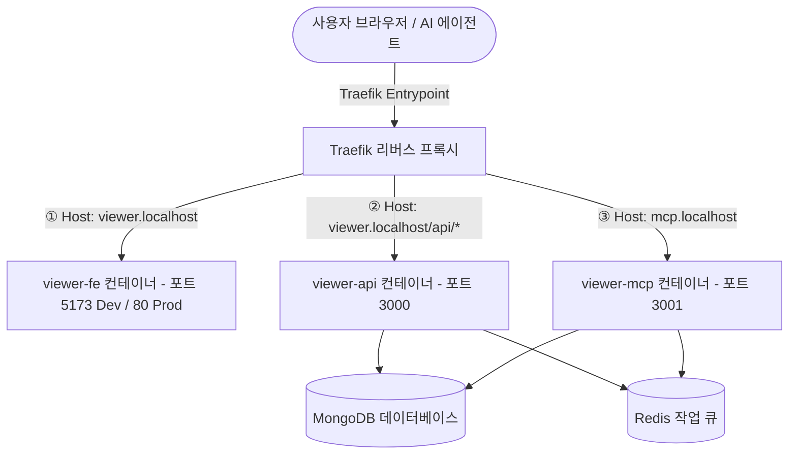

<!--
[Design Context]
본 문서는 뷰어 서비스를 프론트엔드(Vue), 대시보드 백엔드(Express API), 그리고 에이전트 전용 MCP 도구 서버의 3개 독립 서비스로 완전 분리하는 상세 설계서 및 마이그레이션 계획서입니다.
[Dependencies]
- Docker Compose (3개 분할 서비스 구성)
- Traefik Router (viewer-fe, viewer-api, viewer-mcp 라우팅 설정)
- Vite Config (Proxy 및 HMR 웹소켓 연동)
-->

# 🛸 FE / API / MCP 서비스 3단계 완전 분리 마이그레이션 계획서

본 계획서는 기존에 하나의 단일 컨테이너(`viewer`)에 혼합되어 있던 **프론트엔드(Vue)**, **대시보드 API 백엔드(Express)**, 그리고 **에이전트 제어용 MCP 서버**를 3개의 완벽하게 독립된 물리 서비스로 쪼개어 개발 편의성(HMR) 및 장애 격리성(Fault Isolation)을 극대화하기 위한 상세 마이그레이션 계획서입니다.

---

## 📐 1. 개선 아키텍처 모델 (Target Architecture)

---

## 🛠️ 2. 서비스별 상세 아키텍처 스펙

| 서비스명 (Service) | 역할 (Role) | 포트 (Port) | 도메인 라우팅 (Host Rule) | 개발 볼륨 마운트 (Volume) |
| :--- | :--- | :--- | :--- | :--- |
| **`viewer-fe`** | Vue 3 웹 화면 서빙 (HMR 지원) | `5173` | `viewer.localhost` | `src/viewer/frontend` |
| **`viewer-api`** | 대시보드 전용 REST API & 로그 분석 | `3000` | `viewer.localhost/api/*` | 실시간 볼륨 동기화 불필요 (재빌드 경량화) |
| **`viewer-mcp`** | 에이전트 제어용 SSE/HTTP 통신 어댑터 | `3001` | `mcp.localhost` | 실시간 볼륨 동기화 불필요 |

---

## 📋 3. 단계별 마이그레이션 구현 절차 (Implementation Steps)

### 1단계: 백엔드 코드 분리 및 독자 엔트리포인트 설계
1.  **`viewer-api` (대시보드 API)**:
    *   `src/viewer/server.ts`에서 더 이상 `setupMcpServer`를 호출하지 않고 주석 처리/삭제하여 MCP 모듈 결합을 느슨하게 격리합니다.
    *   프론트엔드 개발 서버(`viewer-fe:5173`)로부터의 접근을 허용하도록 CORS 정책을 보강합니다.
2.  **`viewer-mcp` (MCP 전용 엔트리포인트 생성)**:
    *   새로운 진입 파일인 `src/viewer/mcp-entry.ts`를 생성하여 Express와 MCP 모듈(`setupMcpServer`)만 단독 바인딩하고 독립 포트 **`3001`**에서 동작하도록 작성합니다.
    *   `app.get('/sse')` 및 `app.post('/messages')` 전용 라우터만 열어 리소스를 가볍게 유지합니다.

### 2단계: 프론트엔드(FE) 핫 리로드 설정 구축
1.  **Vite 개발용 Dockerfile 추가**:
    *   `docker/tools/viewer-fe/Dockerfile.dev`를 새로 만들어 노드 종속성 설치 후 개발 서버(`npm run dev`)를 가동하도록 정의합니다.
2.  **프록시 및 HMR 매핑**:
    *   `src/viewer/frontend/vite.config.ts` 파일에 프록시 설정을 추가하여 프론트엔드가 호출하는 `/api` 요청이 Docker 네트워크 내부의 `viewer-api:3000`으로 매핑되도록 연결합니다.
    *   WSL 환경에서 HMR(핫 모듈 리플레이스먼트) 웹소켓 통신 포트를 포워딩할 수 있게 HMR 서버 통신 옵션을 보강합니다.

### 3단계: Docker Compose 파일 분할 적용
1.  `docker/tools/viewer/compose.yml`을 수정하여 3개의 서비스로 분해 선언합니다:
    *   **`viewer-fe`**: `docker/tools/viewer-fe/Dockerfile.dev` 빌드, 로컬 볼륨 마운트, 포트 `5173` 배정.
    *   **`viewer-api`**: `npx ts-node src/viewer/server.ts` 실행, 포트 `3000` 배정.
    *   **`viewer-mcp`**: `npx ts-node src/viewer/mcp-entry.ts` 실행, 포트 `3001` 배정.
2.  **Traefik Lables 규칙 최종 세분화**:
    *   `viewer-fe`: `Host("viewer.localhost")`
    *   `viewer-api`: `Host("viewer.localhost") && PathPrefix("/api")`
    *   `viewer-mcp`: `Host("mcp.localhost")` 및 포트 `3001` 맵핑.

### 4단계: 통합 검증 및 포트 스캔 테스트
1.  삼중 가동 후 각 도메인 채널 통신 테스트 진행:
    *   `http://viewer.localhost` 접속 시 즉각적인 Vue 화면 로딩 및 소스 수정 시 HMR 반영 여부 확인.
    *   `http://viewer.localhost/api/collections` 호출 시 백엔드 API 작동 여부 확인.
    *   `http://mcp.localhost/sse` 접근 시 MCP 연결 신호 정상 응답 여부 확인.
