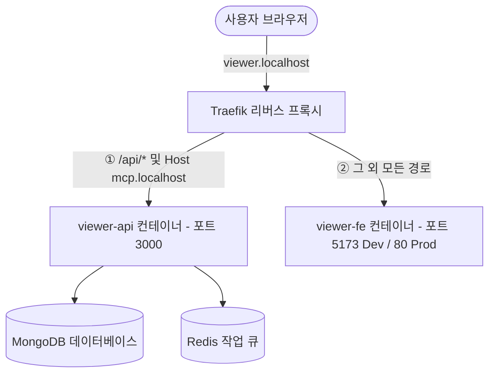

<!--
[Design Context]
본 문서는 뷰어 서비스의 프론트엔드(Vue)와 백엔드(Express) 분리를 위한 상세 설계서 및 마이그레이션 계획서입니다.
[Dependencies]
- Docker Compose
- Traefik Router
- Vite Config
-->

# 🛸 FE/BE 서비스 분리 및 HMR(핫 리로드) 마이그레이션 계획서

본 문서는 현재 하나의 단일 컨테이너(`viewer`)로 통합 작동하고 있는 프론트엔드(Vue 3)와 백엔드(Express/TS) 서버를 별개의 서비스로 분리하여 개발 편의성(HMR) 및 아키텍처 격리성을 극대화하기 위한 상세 마이그레이션 계획서입니다.

---

## 📐 1. 개선 아키텍처 모델



---

## 🛠️ 2. 단계별 구현 절차 (Implementation Steps)

### 1단계: 백엔드(BE) 수정 및 CORS 연동
1.  **CORS 설정 적용**: 백엔드 서버(`src/viewer/server.ts`)에 외부 프론트엔드 출처(Vite Dev Server 포트 등)의 비동기 자원 요청을 수용할 수 있도록 CORS 미들웨어를 장착합니다.
2.  **정적 서빙 분기**: `src/viewer/server.ts` 내의 `express.static` 및 `dist/index.html` 폴백 코드들을 프로덕션 환경(`process.env.NODE_ENV === 'production'`)에서만 동작하도록 분기 처리합니다.

### 2단계: 프론트엔드(FE) 개발용 컨테이너 생성
1.  Vite 개발 서버 환경 구동을 위해 `docker/tools/viewer-fe/Dockerfile.dev` 파일을 신규 생성합니다. (기본 CMD: `npm run dev`)
2.  도커 컴포즈 파일에서 프론트엔드 소스 디렉터리(`src/viewer/frontend`)를 볼륨 마운트하여 소스 수정 시 즉각 HMR(Hot Module Replacement)이 발생하도록 설정합니다.

### 3단계: Docker Compose 및 Traefik 라우터 설정 분리
1.  `docker/tools/viewer/compose.yml`을 수정하여 기존 `viewer` 서비스를 두 개의 서비스로 분해합니다.
    *   **`viewer-api`**: 백엔드 포트 `3000` 가동 및 데이터베이스/Redis 연동 담당.
    *   **`viewer-fe`**: 프론트엔드 웹 서버 가동 담당.
2.  **Traefik 라우팅 분기**:
    *   `viewer-api` 레이블 규칙: `Host("viewer.localhost") && PathPrefix("/api")` 및 `Host("mcp.localhost")` 경로 처리.
    *   `viewer-fe` 레이블 규칙: 그 외 `Host("viewer.localhost")` 기본 도메인 접속 처리.

### 4단계: Vite Proxy 및 웹소켓 설정 보강
1.  `vite.config.ts` 파일에 `server.proxy` 설정을 구성하여 로컬 브라우저 개발 시 `/api`로 향하는 요청을 내부 백엔드 컴포즈 컨테이너 포트(`viewer-api:3000`)로 프록시 전달합니다.
2.  WSL 및 역방향 프록시 환경에서 핫 리로드 웹소켓이 끊기지 않도록 `server.hmr` 설정을 추가로 잡아줍니다.

---

## ⚖️ 3. MCP 서비스 분리 설계 대안 비교 (API vs MCP Separation)

에이전트가 사용하는 MCP 채널과 사용자 대시보드 API 채널을 추가로 분리할지에 대한 아키텍처적 검토입니다.

### 대안 ①: FE/BE 2단계 분할 (하이브리드 백엔드 구조)
*   **구조**: 프론트엔드(`viewer-fe`)만 분리하고, 백엔드는 하나의 컨테이너(`viewer-api`)가 REST API와 MCP 서버(`/sse`)를 동시에 호스팅합니다.
*   **특징**:
    *   커넥션 풀 공유: MongoDB 및 Redis 커넥션 인스턴스를 하나로 공유하므로 전체 시스템 리소스 소모가 적습니다.
    *   간단한 배포: Docker Compose 서비스 정의가 2개로 유지되므로 단순합니다.

### 대안 ②: FE/API/MCP 3단계 완전 분할 (마이크로서비스 구조)
*   **구조**: 프론트엔드(`viewer-fe`), 대시보드 백엔드(`viewer-api`), MCP 도구 서버(`viewer-mcp`)의 3개 서비스로 완전히 파편화하여 분리합니다.
*   **특징**:
    *   장애 격리: 에이전트가 무거운 도구 호출(예: 대용량 데이터 수집/인덱싱)을 요청하여 MCP 서버 메모리가 고갈되거나 랙이 걸려도, 사용자가 보는 대시보드(`viewer-api`)는 전혀 지장을 받지 않고 안전하게 동작합니다.
    *   보안 제어: 트래픽 규칙상 `Host("mcp.localhost")`만 허용하는 포트(`3001`)와 대시보드 API용 포트(`3000`)를 분리하므로, 외부 접근 보안 정책(IP ACL, 인증 헤더 적용 등)의 설계가 견고해집니다.
    *   **흐름도**:
        ```mermaid
        graph TD
            User([사용자 브라우저]) --> Traefik[Traefik 프록시]
            Traefik -->|① Host: viewer.localhost| FE[viewer-fe 컨테이너]
            Traefik -->|② Host: viewer.localhost/api/*| API[viewer-api 컨테이너 - 포트 3000]
            Traefik -->|③ Host: mcp.localhost| MCP[viewer-mcp 컨테이너 - 포트 3001]
            
            API --> DB[(Database)]
            MCP --> DB
        ```

### 의사결정 제안 (Decision Recommendation)
로컬 리소스 자원을 아끼고 단일 백엔드 코드 베이스로 빠르게 구성하기 위해, 1차적으로 **대안 ① (하이브리드 백엔드)**을 기본 모델로 채택하되, 추후 에이전트 사용량이 증가하고 부하 테스트가 필요해지는 시점에 `viewer-mcp` 서비스를 별도의 도커 데몬 및 서비스 포트로 분리 구동할 수 있도록 백엔드 디렉터리 내에 독립적인 엔트리포인트(`src/viewer/mcp-entry.ts`) 설계 기반을 선제적으로 닦아둡니다.

