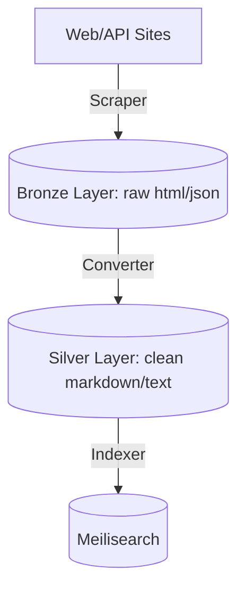

# Scraper & Converter Pipeline Specification

## 1. Overview
This project runs a multi-tier data processing pipeline to scrape web articles and jobs, convert them into clean markdown documents, and index them into a search engine.

---

## 2. Pipeline Tiers (Layers)

### 2.1. Bronze Layer (Raw Storage)
- **Purpose**: Act as an immutable, raw snapshot of crawled pages.
- **Collections**:
  - `bronze/${siteKey}.html`: Stores the raw HTML payload of target URLs.
    - Fields: `id`, `url`, `rawHtml`, `createdAt`
  - `bronze/${siteKey}.urls`: Manages tracking and dispatch state of urls.
    - Fields: `id`, `url`, `title`, `status` (`new` | `completed` | `failed`), `pushedToRedis` (`true` | `false`)

### 2.2. Silver Layer (Clean Metadata)
- **Purpose**: Structure raw documents into standardized schemas, extracting main text in Markdown format.
- **Collections**:
  - `silver/${siteKey}.contents`:
    - Fields: `id`, `title`, `url`, `publishedAt`, `content` (cleaned plaintext), `markdown` (cleaned markdown text), `updatedAt`

### 2.3. Gold Layer (Indexing)
- **Purpose**: Search indices optimized for user query parsing.
- **Indices**:
  - Meilisearch indexes populated from the Silver Layer.

---

## 3. ID Generation Protocol (Rule 1: Failure Handling)
To prevent Linux filesystem length limitations (`ENAMETOOLONG` max 255 chars), **all target document IDs must be deterministic, fixed-length hashes**:
- **Standard Hash**: MD5 (32-character hex string) based on the normalized URL.
- **Normalized URL Rule**: Strip tracking parameters (`utm_*`, etc.), standardise protocol (`https`), and exclude trailing slashes.

---

## 4. Cache & Queue Redis Key Schema
- **Queues**: `sites:${siteKey}:scrape:${priority}` (where priority = `high` | `medium` | `low`)
- **Completion Caches**: `sites:${siteKey}:completed` (Redis Set holding completed IDs)
