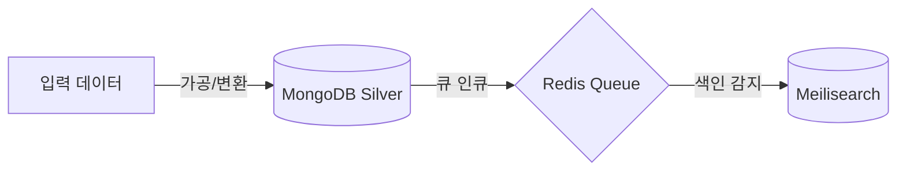

# Specs: [기능/파이프라인 이름]

## 1. 개요 및 목적 (Overview & Goals)
- **기능 설명**: 이 사양서가 다루는 제품/비즈니스 요구사항 및 기능 요약.
- **해결하려는 문제**: 이 기능이 해결하고자 하는 구체적인 불편함이나 목표.

## 2. 입출력 데이터 명세 (Data Specification)
- **입력 데이터 (Input Data)**:
  - 포맷 (예: HTML, JSON, EPUB, PDF 등)
  - 스키마/메타데이터 필수 필드
- **출력 데이터 (Output Data)**:
  - 포맷 (예: 정제 Markdown, JSON 등)
  - 저장 대상 데이터베이스 컬렉션 및 스키마 구조
  ```typescript
  // 예시 인터페이스 정의
  interface ExpectedOutput {
    id: string;
    content: string;
  }
  ```

## 3. 파이프라인 흐름 (Data Flow / Pipeline Sequence)
수집부터 정제, 색인까지의 데이터 흐름을 명시합니다.


## 4. 제약 사항 및 예외 규칙 (Constraints & Edge Cases)
- **예외 사항**: 특정 특수기호 제거, 빈 파일 유입 시 대처 등.
- **제약 조건**: 파일 이름 최대 길이(255자) 제약, 중복 필터링 규칙 등.
